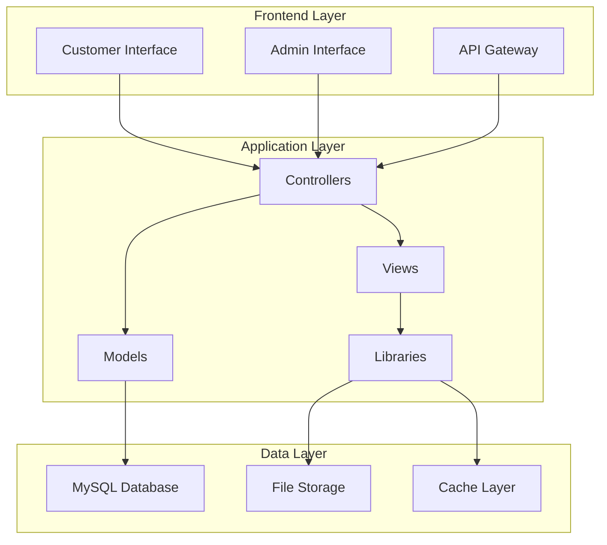

# O9Cart - Advanced E-commerce Platform

## Overview

[](https://php.net/)
[](LICENSE.md)
[](#documentation)

O9Cart is an advanced e-commerce platform built on OpenCart foundations, providing a professional and reliable foundation for building successful online stores. This enhanced version includes additional features, improved architecture, and comprehensive documentation.

## 🚀 Features

- **Multi-vendor Support**: Built-in marketplace functionality
- **Advanced Analytics**: Comprehensive reporting and analytics dashboard
- **Modern UI/UX**: Responsive design with modern interface
- **Extensible Architecture**: Plugin-based extension system
- **API-First Design**: RESTful API for headless commerce
- **Multi-language & Multi-currency**: Global commerce support
- **Advanced SEO**: Built-in SEO optimization tools
- **Performance Optimized**: Caching and optimization features

## 🏗️ Architecture

O9Cart follows a modern MVC (Model-View-Controller) architecture with the following key components:



For detailed architecture documentation, see [Technical Architecture](docs/architecture.md).

## 📋 Quick Start

### Prerequisites

- PHP 8.0 or higher
- MySQL 8.0+ or MariaDB 10.3+
- Apache/Nginx web server
- Composer for dependency management

### Installation

1. **Clone the repository**:
   ```bash
   git clone https://github.com/EchoCog/o9cart.git
   cd o9cart
   ```

2. **Install dependencies**:
   ```bash
   composer install
   ```

3. **Configure the application**:
   ```bash
   cp upload/config-dist.php upload/config.php
   cp upload/admin/config-dist.php upload/admin/config.php
   ```

4. **Set up the database and complete installation**:
   - Visit your site URL
   - Follow the installation wizard
   - Remove the `/install` directory after completion

For detailed installation instructions, see [INSTALL.md](INSTALL.md).

## 🐳 Docker Development Environment

Get started quickly with our Docker environment:

```bash
# Initialize and start the environment
make init
make build
make up
```

Your store will be available at `http://localhost`.

For more Docker commands and configuration, see the [Docker Development](#local-development-with-docker) section below.

## 📚 Documentation

- [📖 **Technical Architecture**](docs/architecture.md) - System architecture and design patterns
- [🔧 **Developer Guide**](docs/developer-guide.md) - Development setup and guidelines  
- [🚀 **Deployment Guide**](docs/deployment.md) - Production deployment strategies
- [📊 **Database Schema**](docs/database-schema.md) - Database structure documentation
- [🔌 **API Documentation**](docs/api-reference.md) - RESTful API reference
- [🎨 **Theme Development**](docs/theme-development.md) - Custom theme creation
- [📋 **Complete Documentation**](docs/index.md) - Full documentation index

### Quick Links
- [Installation Guide](INSTALL.md) - Get started quickly
- [Docker Development](#local-development-with-docker) - Development with Docker
- [API Reference](docs/api-reference.md) - REST API documentation
- [Contributing Guidelines](#how-to-contribute) - How to contribute

## 🛡️ System Requirements

### Minimum Requirements
- **PHP**: 8.0.2 or higher
- **Database**: MySQL 8.0+ or MariaDB 10.3+
- **Memory**: 64MB RAM minimum (128MB recommended)
- **Storage**: 100MB disk space minimum

### Recommended Environment
- **PHP**: 8.1+ with OPcache enabled
- **Database**: MySQL 8.0+ with InnoDB engine
- **Web Server**: Apache 2.4+ with mod_rewrite or Nginx 1.18+
- **Memory**: 256MB RAM or higher
- **Storage**: SSD storage for better performance

### Required PHP Extensions
```
curl, gd, zip, mysqli, pdo_mysql, mbstring, json, openssl, xml, fileinfo
```

## Reporting a bug

Read the instructions below before you create a bug report.

1. Search the [OpenCart forum](https://forum.opencart.com/viewforum.php?f=201), ask the community if they have seen the bug or know how to fix it.
2. Check all open and closed issues on the [GitHub bug tracker](https://github.com/opencart/opencart/issues).
3. If your bug is related to the OpenCart core code then please create a bug report on GitHub.
4. READ the [changelog for the master branch](https://github.com/opencart/opencart/blob/master/CHANGELOG.md)
5. Use [Google](https://www.google.com) to search for your issue.
6. Make sure that your bug/issue is not related to your hosting environment.

If you are not sure about your issue, it is always best to ask the community on our [bug forum thread](https://forum.opencart.com/viewforum.php?f=201)

**Important!**

- If your bug report is not related to the core code (such as a 3rd party module or your server configuration) then the issue will be closed without a reason. You must contact the extension developer, use the forum or find a commercial partner to resolve a 3rd party code issue.
- If you would like to report a serious security bug please PM an OpenCart moderator/administrator on the forum. Please do not report concept/ideas/unproven security flaws - all security reports are taken seriously but you must include the EXACT details steps to reproduce it. Please DO NOT post security flaws in a public location.

## How to contribute

Fork the repository, edit and [submit a pull request](https://github.com/opencart/opencart/wiki/Creating-a-pull-request).

Please be very clear on your commit messages and pull request, empty pull request messages may be rejected without reason.

Your code standards should match the [OpenCart coding standards](https://github.com/opencart/opencart/wiki/Coding-standards). We use an automated code scanner to check for most basic mistakes - if the test fails your pull request will be rejected.

## Local Development with Docker

This project includes a Docker-based environment for local development.

### Prerequisites

* You must have Docker and Docker Compose installed on your machine. [Docker Desktop](https://www.docker.com/products/docker-desktop/) is the easiest way to get them.
* You must have `make` installed on your system (usually pre-installed on macOS and Linux distributions).

> [!IMPORTANT]
>
> **For Windows Users:**
> It is **strongly recommended** to use the WSL 2 (Windows Subsystem for Linux) backend for Docker Desktop.
> **You should clone this project _inside_ your WSL distribution (e.g., Ubuntu 24.04) for best performance.**
> Access your project via `\\wsl$\Ubuntu-24.04\home\youruser\opencart` from Windows Explorer if needed.
> Without WSL 2, file system performance will be extremely slow, making the application nearly unusable.
> Docker Desktop will typically prompt you to enable WSL 2 during installation.

> [!NOTE]
>
> OpenCart itself does **not** use any `.env` file for its configuration.
> The provided `.env.docker` file is **only** for configuring the Docker Compose environment.
> To avoid confusion with classic development workflows, this file is named `.env.docker` and placed inside the `docker` directory.

### Getting Started

1. Clone the repository to your local machine.
2. Initialize the project:
    ```bash
    make init
    ```
3. Build the images:
    ```bash
    make build
    ```
4. Start all services:
    ```bash
    make up
    ```

After the process is complete, your OpenCart store will be available at `http://localhost`.

### Common Commands

* **To stop the environment:**
    ```bash
    make down
    ```
* **To view the logs from all services:**
    ```bash
    make logs
    ```
* **To enter the PHP container:**
    ```bash
    make php
    ```
* **To see all available commands:**
    ```bash
    make help
    ```

### Changing the PHP Version

The environment uses PHP 8.4 by default.
You can easily switch to a different version by editing the `PHP_VERSION` variable in the `docker/.env.docker` file.

For example, to use PHP 8.2, open `docker/.env.docker` and set:

```env
PHP_VERSION=8.2
```

After changing the version, rebuild the images:

```bash
make build
```

### Using Docker Compose Profiles for Optional Services

By default, only the core services (`apache`, `php`, `mysql`) are started.
Optional services such as **Adminer**, **Redis**, **Memcached**, and **PostgreSQL** can be enabled using [Docker Compose profiles](https://docs.docker.com/compose/profiles/).

To enable one or more optional services, use the `--profile` flag and specify your env file:

- **Start with Adminer:**
    ```bash
    make up profiles="adminer"
    ```
- **Start with Redis and Memcached:**
    ```bash
    make up profiles="redis memcached"
    ```
- **Start all optional services:**
    ```bash
   make up profiles="adminer redis memcached postgres"
    ```

> [!TIP]
>
> You can combine any profiles as needed for your development workflow.

## Versioning

The version is broken down into 4 points e.g 1.2.3.4 We use MAJOR.MINOR.FEATURE.PATCH to describe the version numbers.

A MAJOR is very rare, it would only be considered if the source was effectively re-written or a clean break was desired for other reasons. This increment would likely break most 3rd party modules.

A MINOR is when there are significant changes that affect core structures. This increment would likely break some 3rd party modules.

A FEATURE version is when new extensions or features are added (such as a payment gateway, shipping module etc). Updating a feature version is at a low risk of breaking 3rd party modules.

A PATCH version is when a fix is added, it should be considered safe to update patch versions e.g 1.2.3.4 to 1.2.3.5

## Releases

OpenCart will announce to developers 1 week prior to public release of FEATURE versions, this is to allow for testing of their own modules for compatibility. For bigger releases (ones that contain many core changes, features and fixes) an extended period will be considered following an announced release candidate (RC). Patch versions (which are considered safe to update with) may have a significantly reduced developer release period.

The master branch will always contain an "_rc" postfix of the next intended version. The next "_rc" version may change at any time.

Developer release source code will not change once tagged.

If a bug is found in an announced developer release that is significant (such as a major feature is broken) then the release will be pulled. A patch version will be issued to replace it, depending on the severity of the patch an extended testing period may be announced. If the developer release version was never made public then the preceding patch version tag will be removed.

To receive developer notifications about release information, sign up to the newsletter on the [OpenCart website](https://www.opencart.com) - located in the footer. Then choose the developer news option.

## License

[GNU General Public License version 3 (GPLv3)](https://github.com/opencart/opencart/blob/master/LICENSE.md)

## Links

- [OpenCart homepage](https://www.opencart.com/)
- [OpenCart forums](https://forum.opencart.com/)
- [OpenCart blog](https://www.opencart.com/index.php?route=feature/blog)
- [How to documents](http://docs.opencart.com/en-gb/introduction/)
- [Newsletter](https://newsletter.opencart.com/h/r/B660EBBE4980C85C)
- [Discussions](https://github.com/opencart/opencart/discussions)
