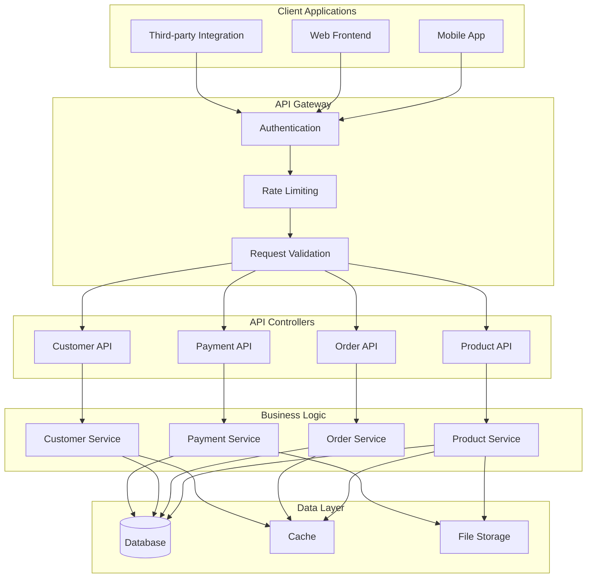
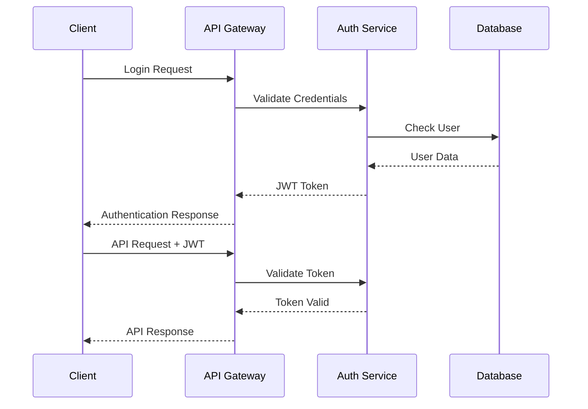
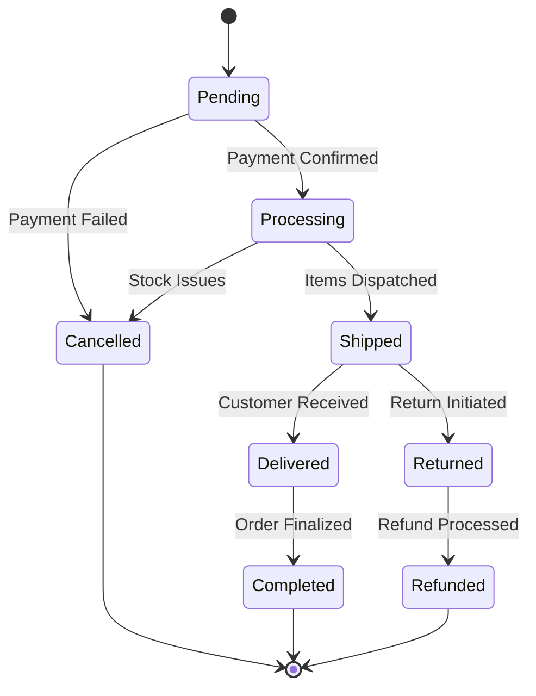

# API Documentation

## Table of Contents

1. [API Overview](#api-overview)
2. [Authentication](#authentication)
3. [Core Endpoints](#core-endpoints)
4. [Product API](#product-api)
5. [Order API](#order-api)
6. [Customer API](#customer-api)
7. [Payment API](#payment-api)
8. [Error Handling](#error-handling)
9. [Rate Limiting](#rate-limiting)
10. [SDK Examples](#sdk-examples)

## API Overview

O9Cart provides a comprehensive RESTful API for integrating with external applications, mobile apps, and third-party services.

### API Architecture



### Base URL
```
Production: https://api.o9cart.com/v1
Staging: https://staging-api.o9cart.com/v1
Development: http://localhost/api/v1
```

### Response Format
All API responses follow a consistent JSON structure:

```json
{
    "success": true,
    "data": {
        // Response data
    },
    "message": "Success",
    "timestamp": "2024-01-15T10:30:00Z",
    "version": "1.0"
}
```

Error responses:
```json
{
    "success": false,
    "error": {
        "code": "VALIDATION_ERROR",
        "message": "Invalid input data",
        "details": {
            "field": ["Field is required"]
        }
    },
    "timestamp": "2024-01-15T10:30:00Z",
    "version": "1.0"
}
```

## Authentication

O9Cart API uses JWT (JSON Web Tokens) for authentication with support for multiple authentication methods.

### Authentication Flow



### Obtaining Access Token

**Endpoint:** `POST /auth/login`

```bash
curl -X POST https://api.o9cart.com/v1/auth/login \
  -H "Content-Type: application/json" \
  -d '{
    "email": "user@example.com",
    "password": "secure_password"
  }'
```

**Response:**
```json
{
    "success": true,
    "data": {
        "access_token": "eyJ0eXAiOiJKV1QiLCJhbGciOiJIUzI1NiJ9...",
        "refresh_token": "eyJ0eXAiOiJKV1QiLCJhbGciOiJIUzI1NiJ9...",
        "token_type": "Bearer",
        "expires_in": 3600,
        "user": {
            "id": 123,
            "email": "user@example.com",
            "name": "John Doe"
        }
    }
}
```

### Using Access Token

Include the access token in the Authorization header:

```bash
curl -X GET https://api.o9cart.com/v1/products \
  -H "Authorization: Bearer YOUR_ACCESS_TOKEN" \
  -H "Content-Type: application/json"
```

### API Key Authentication

For server-to-server integrations:

```bash
curl -X GET https://api.o9cart.com/v1/products \
  -H "X-API-Key: YOUR_API_KEY" \
  -H "Content-Type: application/json"
```

## Core Endpoints

### Health Check

**Endpoint:** `GET /health`

```bash
curl -X GET https://api.o9cart.com/v1/health
```

**Response:**
```json
{
    "success": true,
    "data": {
        "status": "healthy",
        "version": "1.0.0",
        "timestamp": "2024-01-15T10:30:00Z",
        "uptime": 86400,
        "services": {
            "database": "healthy",
            "cache": "healthy",
            "storage": "healthy"
        }
    }
}
```

### System Information

**Endpoint:** `GET /info`

```bash
curl -X GET https://api.o9cart.com/v1/info \
  -H "Authorization: Bearer YOUR_TOKEN"
```

## Product API

### List Products

**Endpoint:** `GET /products`

**Parameters:**
- `page` (integer): Page number (default: 1)
- `limit` (integer): Items per page (default: 20, max: 100)
- `category` (integer): Filter by category ID
- `status` (string): Filter by status (active, inactive)
- `search` (string): Search in name and description
- `sort` (string): Sort field (name, price, date_added)
- `order` (string): Sort order (asc, desc)

```bash
curl -X GET "https://api.o9cart.com/v1/products?page=1&limit=10&category=5&status=active" \
  -H "Authorization: Bearer YOUR_TOKEN"
```

**Response:**
```json
{
    "success": true,
    "data": {
        "products": [
            {
                "id": 123,
                "name": "Premium Laptop",
                "description": "High-performance laptop for professionals",
                "sku": "LAP-001",
                "price": 1299.99,
                "currency": "USD",
                "stock_quantity": 50,
                "category": {
                    "id": 5,
                    "name": "Electronics"
                },
                "images": [
                    {
                        "url": "https://cdn.o9cart.com/products/123/main.jpg",
                        "alt": "Premium Laptop"
                    }
                ],
                "attributes": {
                    "brand": "TechBrand",
                    "model": "Pro-15",
                    "warranty": "2 years"
                },
                "status": "active",
                "created_at": "2024-01-10T09:00:00Z",
                "updated_at": "2024-01-15T14:30:00Z"
            }
        ],
        "pagination": {
            "current_page": 1,
            "per_page": 10,
            "total": 150,
            "total_pages": 15,
            "has_next": true,
            "has_prev": false
        }
    }
}
```

### Get Single Product

**Endpoint:** `GET /products/{id}`

```bash
curl -X GET https://api.o9cart.com/v1/products/123 \
  -H "Authorization: Bearer YOUR_TOKEN"
```

### Create Product

**Endpoint:** `POST /products`

```bash
curl -X POST https://api.o9cart.com/v1/products \
  -H "Authorization: Bearer YOUR_TOKEN" \
  -H "Content-Type: application/json" \
  -d '{
    "name": "New Product",
    "description": "Product description",
    "sku": "PROD-001",
    "price": 99.99,
    "stock_quantity": 100,
    "category_id": 5,
    "status": "active",
    "attributes": {
        "brand": "Brand Name",
        "color": "Blue"
    }
  }'
```

### Update Product

**Endpoint:** `PUT /products/{id}`

```bash
curl -X PUT https://api.o9cart.com/v1/products/123 \
  -H "Authorization: Bearer YOUR_TOKEN" \
  -H "Content-Type: application/json" \
  -d '{
    "name": "Updated Product Name",
    "price": 109.99,
    "stock_quantity": 75
  }'
```

### Delete Product

**Endpoint:** `DELETE /products/{id}`

```bash
curl -X DELETE https://api.o9cart.com/v1/products/123 \
  -H "Authorization: Bearer YOUR_TOKEN"
```

## Order API

### Order Lifecycle



### List Orders

**Endpoint:** `GET /orders`

**Parameters:**
- `customer_id` (integer): Filter by customer
- `status` (string): Filter by order status
- `date_from` (string): Start date (YYYY-MM-DD)
- `date_to` (string): End date (YYYY-MM-DD)

```bash
curl -X GET "https://api.o9cart.com/v1/orders?status=processing&date_from=2024-01-01" \
  -H "Authorization: Bearer YOUR_TOKEN"
```

### Get Single Order

**Endpoint:** `GET /orders/{id}`

```bash
curl -X GET https://api.o9cart.com/v1/orders/12345 \
  -H "Authorization: Bearer YOUR_TOKEN"
```

**Response:**
```json
{
    "success": true,
    "data": {
        "order": {
            "id": 12345,
            "order_number": "ORD-2024-001234",
            "customer": {
                "id": 456,
                "name": "John Doe",
                "email": "john@example.com"
            },
            "status": "processing",
            "total": 1299.99,
            "currency": "USD",
            "items": [
                {
                    "product_id": 123,
                    "name": "Premium Laptop",
                    "quantity": 1,
                    "price": 1299.99,
                    "total": 1299.99
                }
            ],
            "billing_address": {
                "first_name": "John",
                "last_name": "Doe",
                "company": "",
                "address_1": "123 Main St",
                "city": "New York",
                "postcode": "10001",
                "country": "United States"
            },
            "shipping_address": {
                "first_name": "John",
                "last_name": "Doe",
                "address_1": "123 Main St",
                "city": "New York",
                "postcode": "10001",
                "country": "United States"
            },
            "payment": {
                "method": "credit_card",
                "status": "paid",
                "transaction_id": "txn_123456789"
            },
            "shipping": {
                "method": "standard",
                "cost": 0.00,
                "tracking_number": "TRACK123456"
            },
            "created_at": "2024-01-15T10:00:00Z",
            "updated_at": "2024-01-15T11:30:00Z"
        }
    }
}
```

### Create Order

**Endpoint:** `POST /orders`

```bash
curl -X POST https://api.o9cart.com/v1/orders \
  -H "Authorization: Bearer YOUR_TOKEN" \
  -H "Content-Type: application/json" \
  -d '{
    "customer_id": 456,
    "items": [
        {
            "product_id": 123,
            "quantity": 1
        }
    ],
    "billing_address": {
        "first_name": "John",
        "last_name": "Doe",
        "address_1": "123 Main St",
        "city": "New York",
        "postcode": "10001",
        "country_id": 1
    },
    "shipping_address": {
        "first_name": "John",
        "last_name": "Doe",
        "address_1": "123 Main St",
        "city": "New York",
        "postcode": "10001",
        "country_id": 1
    },
    "payment_method": "credit_card",
    "shipping_method": "standard"
  }'
```

### Update Order Status

**Endpoint:** `PUT /orders/{id}/status`

```bash
curl -X PUT https://api.o9cart.com/v1/orders/12345/status \
  -H "Authorization: Bearer YOUR_TOKEN" \
  -H "Content-Type: application/json" \
  -d '{
    "status": "shipped",
    "tracking_number": "TRACK123456",
    "comment": "Order shipped via Standard Delivery"
  }'
```

## Customer API

### List Customers

**Endpoint:** `GET /customers`

```bash
curl -X GET "https://api.o9cart.com/v1/customers?page=1&limit=20" \
  -H "Authorization: Bearer YOUR_TOKEN"
```

### Get Customer

**Endpoint:** `GET /customers/{id}`

```bash
curl -X GET https://api.o9cart.com/v1/customers/456 \
  -H "Authorization: Bearer YOUR_TOKEN"
```

### Create Customer

**Endpoint:** `POST /customers`

```bash
curl -X POST https://api.o9cart.com/v1/customers \
  -H "Authorization: Bearer YOUR_TOKEN" \
  -H "Content-Type: application/json" \
  -d '{
    "first_name": "Jane",
    "last_name": "Smith",
    "email": "jane@example.com",
    "password": "secure_password",
    "phone": "+1-555-0123",
    "newsletter": true
  }'
```

### Customer Orders

**Endpoint:** `GET /customers/{id}/orders`

```bash
curl -X GET https://api.o9cart.com/v1/customers/456/orders \
  -H "Authorization: Bearer YOUR_TOKEN"
```

## Payment API

### Payment Methods

**Endpoint:** `GET /payment-methods`

```bash
curl -X GET https://api.o9cart.com/v1/payment-methods \
  -H "Authorization: Bearer YOUR_TOKEN"
```

### Process Payment

**Endpoint:** `POST /payments`

```bash
curl -X POST https://api.o9cart.com/v1/payments \
  -H "Authorization: Bearer YOUR_TOKEN" \
  -H "Content-Type: application/json" \
  -d '{
    "order_id": 12345,
    "payment_method": "credit_card",
    "amount": 1299.99,
    "currency": "USD",
    "card": {
        "number": "4111111111111111",
        "expiry_month": "12",
        "expiry_year": "2025",
        "cvv": "123",
        "holder_name": "John Doe"
    }
  }'
```

### Payment Status

**Endpoint:** `GET /payments/{transaction_id}`

```bash
curl -X GET https://api.o9cart.com/v1/payments/txn_123456789 \
  -H "Authorization: Bearer YOUR_TOKEN"
```

## Error Handling

### Error Codes

| HTTP Status | Error Code | Description |
|------------|------------|-------------|
| 400 | VALIDATION_ERROR | Invalid input data |
| 401 | UNAUTHORIZED | Invalid or missing authentication |
| 403 | FORBIDDEN | Insufficient permissions |
| 404 | NOT_FOUND | Resource not found |
| 409 | CONFLICT | Resource conflict (duplicate) |
| 422 | UNPROCESSABLE_ENTITY | Validation failed |
| 429 | RATE_LIMIT_EXCEEDED | Too many requests |
| 500 | INTERNAL_ERROR | Server error |

### Error Response Format

```json
{
    "success": false,
    "error": {
        "code": "VALIDATION_ERROR",
        "message": "The given data was invalid",
        "details": {
            "email": ["The email field is required"],
            "password": ["The password must be at least 8 characters"]
        }
    },
    "timestamp": "2024-01-15T10:30:00Z",
    "request_id": "req_123456789"
}
```

## Rate Limiting

API requests are rate limited to ensure fair usage:

- **Authenticated requests**: 1000 requests per hour per user
- **Unauthenticated requests**: 100 requests per hour per IP
- **Bulk operations**: 10 requests per minute

Rate limit headers are included in responses:

```http
X-RateLimit-Limit: 1000
X-RateLimit-Remaining: 999
X-RateLimit-Reset: 1640995200
```

## SDK Examples

### PHP SDK

```php
<?php
require_once 'vendor/autoload.php';

use O9Cart\ApiClient;

$client = new ApiClient([
    'base_url' => 'https://api.o9cart.com/v1',
    'api_key' => 'your-api-key'
]);

// Get products
$products = $client->products()->list([
    'category' => 5,
    'limit' => 10
]);

// Create order
$order = $client->orders()->create([
    'customer_id' => 123,
    'items' => [
        ['product_id' => 456, 'quantity' => 1]
    ]
]);
```

### JavaScript SDK

```javascript
import O9CartAPI from '@o9cart/api-client';

const client = new O9CartAPI({
    baseUrl: 'https://api.o9cart.com/v1',
    apiKey: 'your-api-key'
});

// Get products
const products = await client.products.list({
    category: 5,
    limit: 10
});

// Create order
const order = await client.orders.create({
    customer_id: 123,
    items: [
        { product_id: 456, quantity: 1 }
    ]
});
```

### Python SDK

```python
from o9cart import ApiClient

client = ApiClient(
    base_url='https://api.o9cart.com/v1',
    api_key='your-api-key'
)

# Get products
products = client.products.list(
    category=5,
    limit=10
)

# Create order
order = client.orders.create({
    'customer_id': 123,
    'items': [
        {'product_id': 456, 'quantity': 1}
    ]
})
```

For more detailed API documentation and interactive examples, visit our [API Explorer](https://api-docs.o9cart.com).