# Technical Architecture Documentation

## Table of Contents

1. [System Overview](#system-overview)
2. [Application Architecture](#application-architecture)
3. [Database Architecture](#database-architecture)
4. [Component Architecture](#component-architecture)
5. [Security Architecture](#security-architecture)
6. [Performance Architecture](#performance-architecture)
7. [Deployment Architecture](#deployment-architecture)

## System Overview

O9Cart is built on a modern, scalable architecture that follows industry best practices for e-commerce platforms. The system is designed with modularity, performance, and security as core principles.

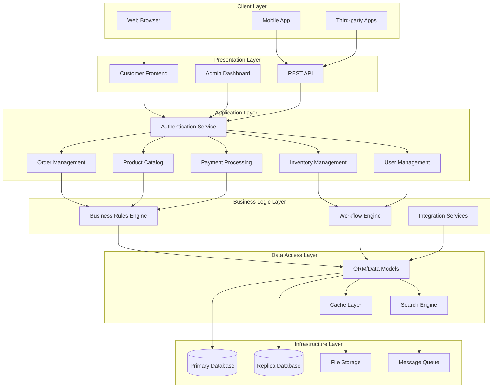

## Application Architecture

O9Cart follows a Model-View-Controller (MVC) architectural pattern enhanced with additional layers for better separation of concerns.

### Core Components

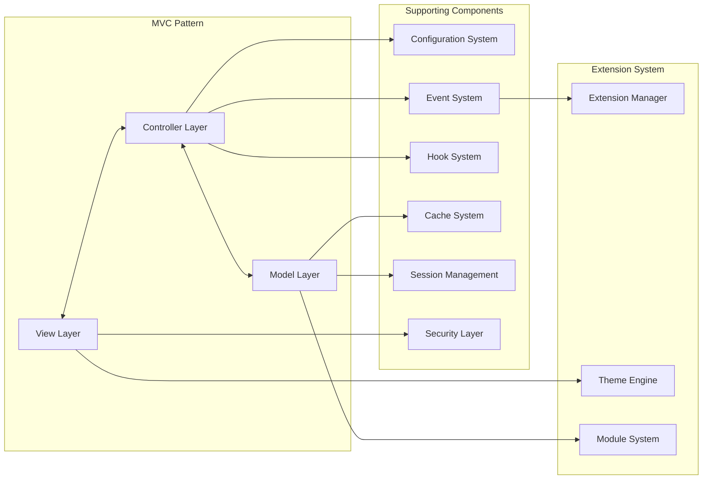

### Request Flow

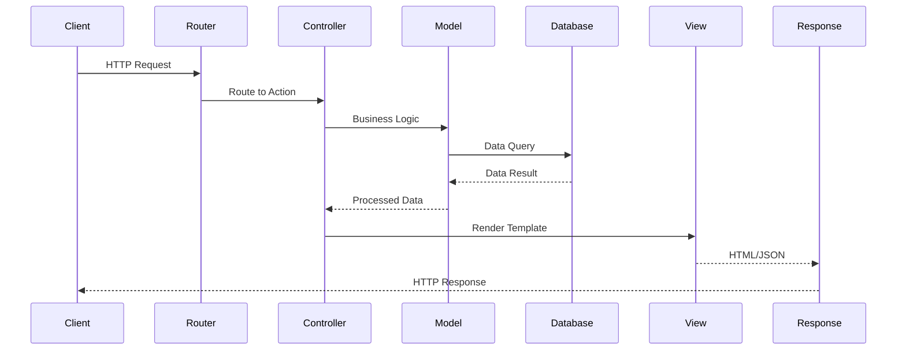

## Database Architecture

O9Cart uses a relational database design optimized for e-commerce operations.

### Database Schema Overview

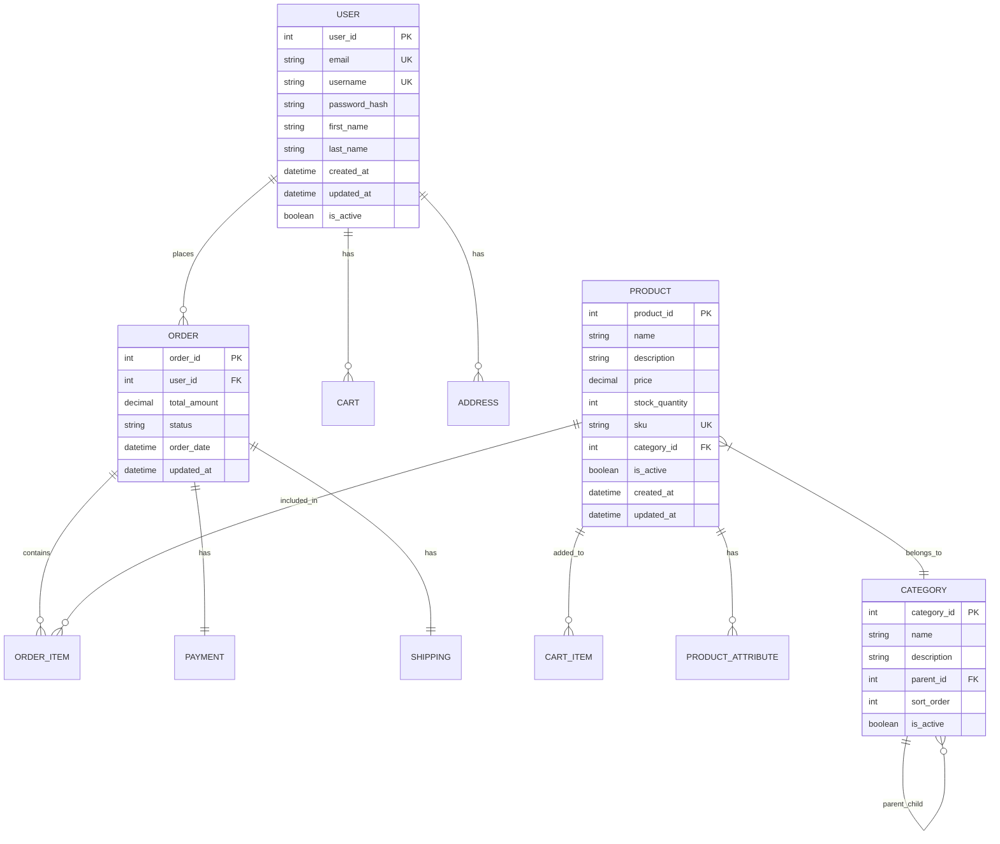

### Data Flow Architecture

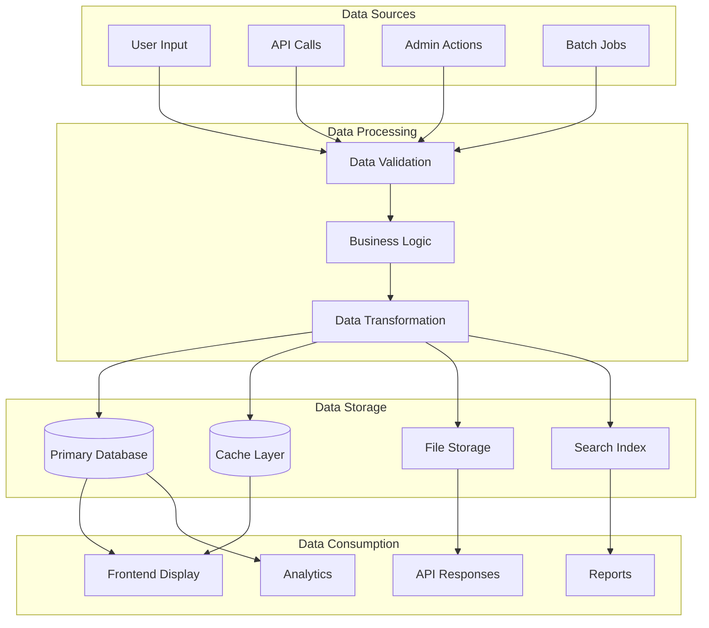

## Component Architecture

### Core System Components

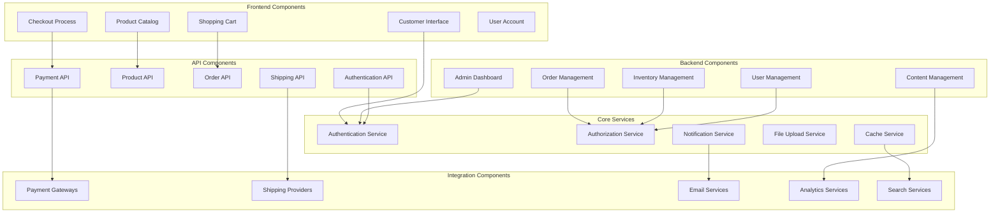

### Extension System Architecture

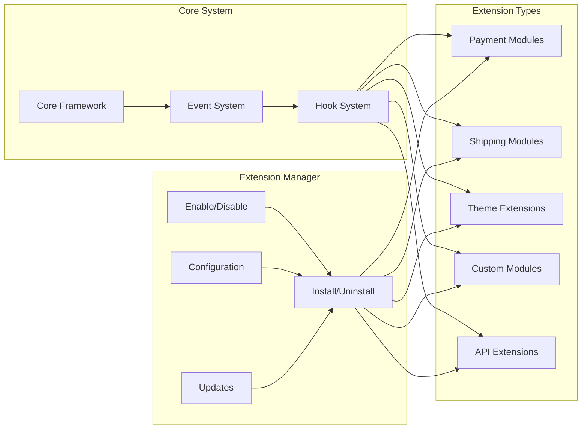

## Security Architecture

### Security Layers

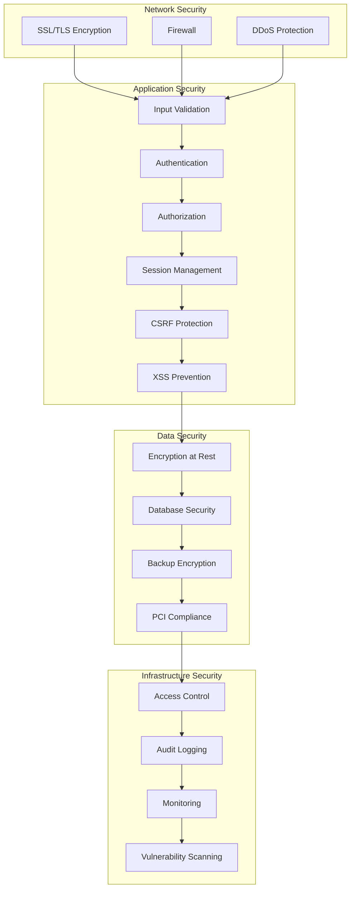

### Authentication Flow

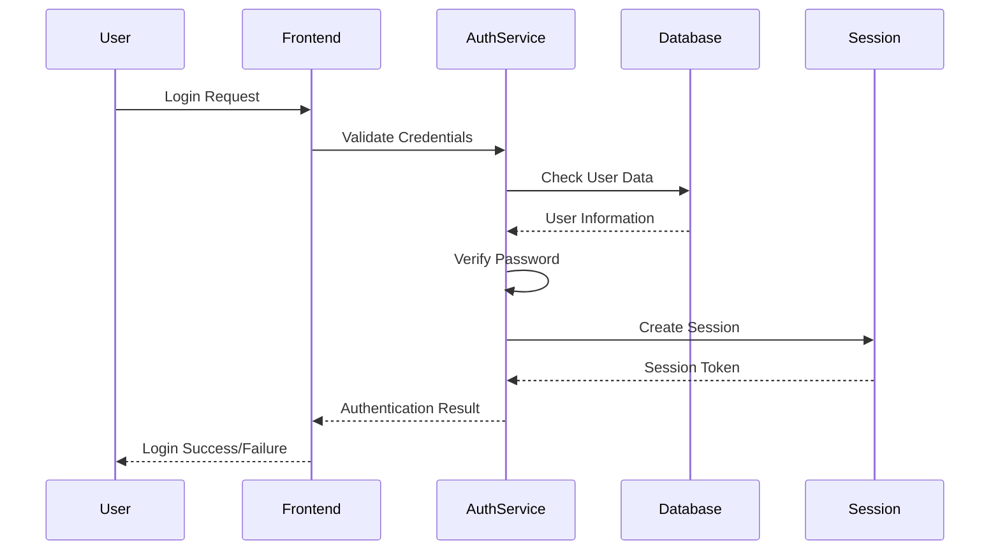

## Performance Architecture

### Caching Strategy

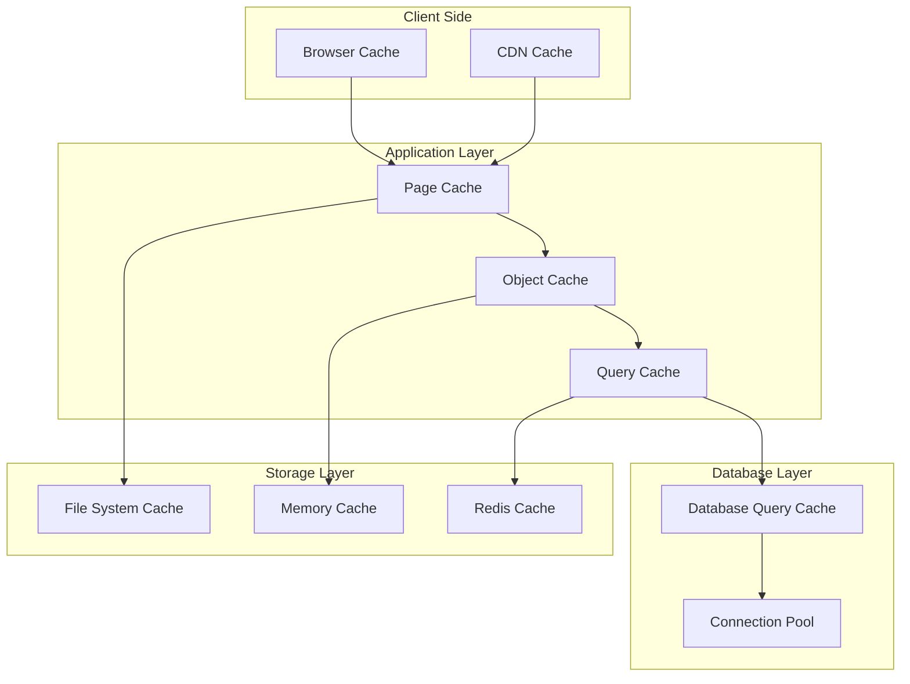

### Load Balancing Architecture

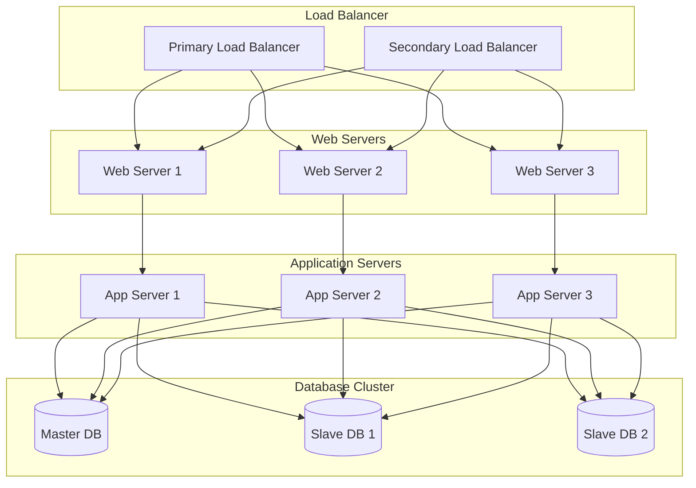

## Deployment Architecture

### Multi-Environment Setup

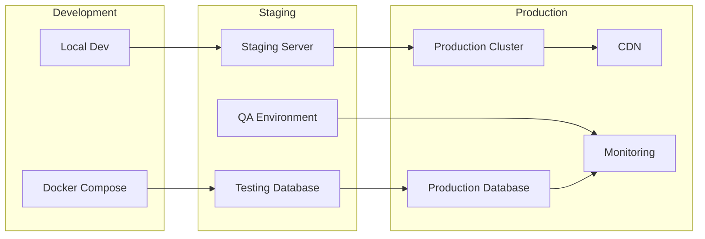

### CI/CD Pipeline

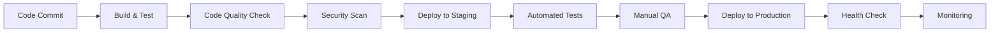

## Technology Stack

### Backend Stack
- **Framework**: Custom PHP MVC Framework
- **Database**: MySQL 8.0+
- **Cache**: Redis/Memcached
- **Search**: Elasticsearch (optional)
- **Queue**: Redis/RabbitMQ

### Frontend Stack
- **Templates**: Twig Template Engine
- **CSS Framework**: Bootstrap 5
- **JavaScript**: Vanilla JS + jQuery
- **Icons**: Font Awesome
- **Charts**: Chart.js

### DevOps Stack
- **Containerization**: Docker
- **Web Server**: Apache/Nginx
- **Monitoring**: Custom logging system
- **Documentation**: Daux.io with Mermaid

## Best Practices

### Code Organization
- Follow PSR-4 autoloading standards
- Implement dependency injection
- Use proper error handling
- Write unit tests for critical components

### Performance
- Implement proper caching strategies
- Optimize database queries
- Use CDN for static assets
- Enable compression

### Security
- Follow OWASP security guidelines
- Implement proper input validation
- Use parameterized queries
- Regular security updates

### Maintenance
- Regular backups
- Monitor system performance
- Keep dependencies updated
- Document all changes