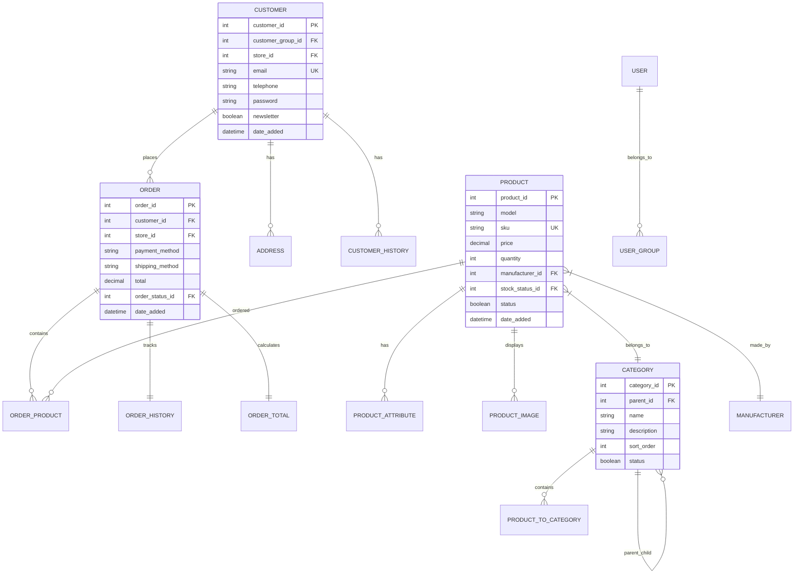
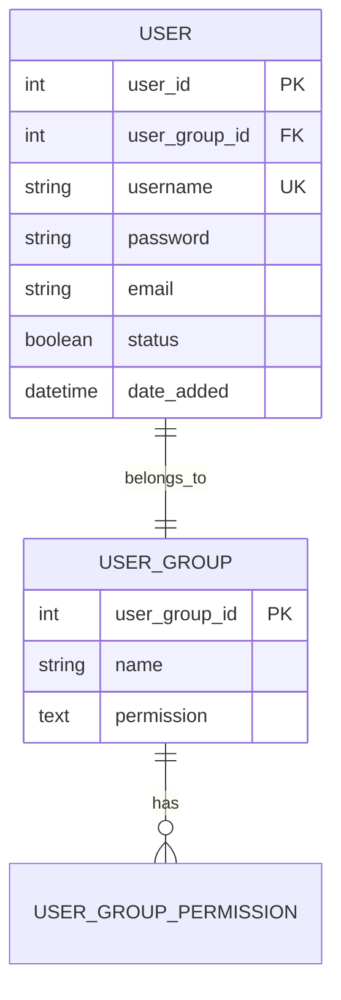
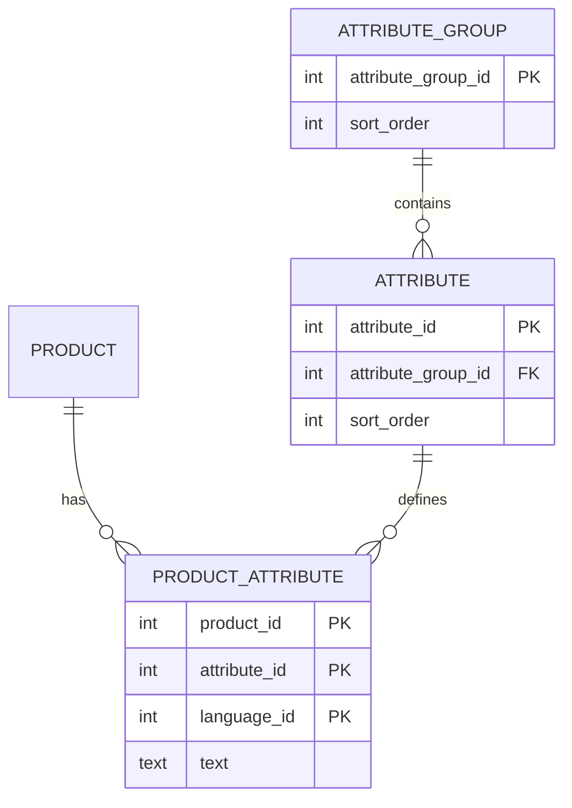
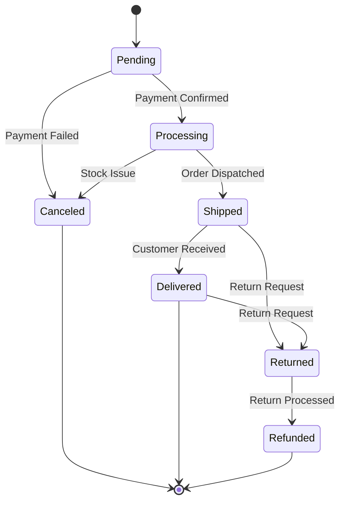
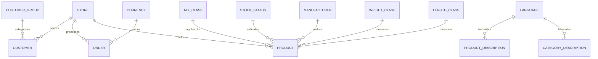

# Database Schema Documentation

## Table of Contents

1. [Schema Overview](#schema-overview)
2. [Core Tables](#core-tables)
3. [User Management](#user-management)
4. [Product Catalog](#product-catalog)
5. [Order Management](#order-management)
6. [Content Management](#content-management)
7. [System Tables](#system-tables)
8. [Extension Tables](#extension-tables)
9. [Database Relationships](#database-relationships)
10. [Indexing Strategy](#indexing-strategy)

## Schema Overview

O9Cart uses a comprehensive database schema designed for scalable e-commerce operations. The database follows a normalized structure with clear relationships between entities.

### Database Statistics
- **Total Tables**: ~100 tables
- **Table Prefix**: `oc_` (configurable)
- **Engine**: InnoDB (recommended)
- **Character Set**: utf8mb4
- **Collation**: utf8mb4_unicode_ci

### Entity Relationship Overview



## Core Tables

### Customer Tables

#### `oc_customer`
Primary customer information table.

```sql
CREATE TABLE `oc_customer` (
    `customer_id` int(11) NOT NULL AUTO_INCREMENT,
    `customer_group_id` int(11) NOT NULL,
    `store_id` int(11) NOT NULL DEFAULT '0',
    `language_id` int(11) NOT NULL,
    `firstname` varchar(32) NOT NULL,
    `lastname` varchar(32) NOT NULL,
    `email` varchar(96) NOT NULL,
    `telephone` varchar(32) NOT NULL,
    `password` varchar(255) NOT NULL,
    `newsletter` tinyint(1) NOT NULL DEFAULT '0',
    `ip` varchar(40) NOT NULL,
    `status` tinyint(1) NOT NULL,
    `safe` tinyint(1) NOT NULL,
    `token` text NOT NULL,
    `code` varchar(40) NOT NULL,
    `date_added` datetime NOT NULL,
    PRIMARY KEY (`customer_id`),
    UNIQUE KEY `email` (`email`),
    KEY `customer_group_id` (`customer_group_id`),
    KEY `store_id` (`store_id`)
);
```

**Relationships:**
- `customer_group_id` → `oc_customer_group.customer_group_id`
- `store_id` → `oc_store.store_id`
- `language_id` → `oc_language.language_id`

#### `oc_address`
Customer address information.

```sql
CREATE TABLE `oc_address` (
    `address_id` int(11) NOT NULL AUTO_INCREMENT,
    `customer_id` int(11) NOT NULL,
    `firstname` varchar(32) NOT NULL,
    `lastname` varchar(32) NOT NULL,
    `company` varchar(60) NOT NULL,
    `address_1` varchar(128) NOT NULL,
    `address_2` varchar(128) NOT NULL,
    `city` varchar(128) NOT NULL,
    `postcode` varchar(10) NOT NULL,
    `country_id` int(11) NOT NULL DEFAULT '0',
    `zone_id` int(11) NOT NULL DEFAULT '0',
    `custom_field` text NOT NULL,
    PRIMARY KEY (`address_id`),
    KEY `customer_id` (`customer_id`)
);
```

### Product Tables

#### `oc_product`
Main product information table.

```sql
CREATE TABLE `oc_product` (
    `product_id` int(11) NOT NULL AUTO_INCREMENT,
    `model` varchar(64) NOT NULL,
    `sku` varchar(64) NOT NULL,
    `upc` varchar(12) NOT NULL,
    `ean` varchar(14) NOT NULL,
    `jan` varchar(13) NOT NULL,
    `isbn` varchar(17) NOT NULL,
    `mpn` varchar(64) NOT NULL,
    `location` varchar(128) NOT NULL,
    `quantity` int(4) NOT NULL DEFAULT '0',
    `stock_status_id` int(11) NOT NULL,
    `image` varchar(255) DEFAULT NULL,
    `manufacturer_id` int(11) NOT NULL,
    `shipping` tinyint(1) NOT NULL DEFAULT '1',
    `price` decimal(15,4) NOT NULL DEFAULT '0.0000',
    `points` int(8) NOT NULL DEFAULT '0',
    `tax_class_id` int(11) NOT NULL,
    `date_available` date NOT NULL DEFAULT '0000-00-00',
    `weight` decimal(15,8) NOT NULL DEFAULT '0.00000000',
    `weight_class_id` int(11) NOT NULL DEFAULT '0',
    `length` decimal(15,8) NOT NULL DEFAULT '0.00000000',
    `width` decimal(15,8) NOT NULL DEFAULT '0.00000000',
    `height` decimal(15,8) NOT NULL DEFAULT '0.00000000',
    `length_class_id` int(11) NOT NULL DEFAULT '0',
    `subtract` tinyint(1) NOT NULL DEFAULT '1',
    `minimum` int(11) NOT NULL DEFAULT '1',
    `sort_order` int(11) NOT NULL DEFAULT '0',
    `status` tinyint(1) NOT NULL DEFAULT '0',
    `viewed` int(5) NOT NULL DEFAULT '0',
    `date_added` datetime NOT NULL,
    `date_modified` datetime NOT NULL,
    PRIMARY KEY (`product_id`),
    UNIQUE KEY `sku` (`sku`),
    KEY `manufacturer_id` (`manufacturer_id`),
    KEY `stock_status_id` (`stock_status_id`),
    KEY `date_available` (`date_available`),
    KEY `status` (`status`)
);
```

#### `oc_product_description`
Multilingual product descriptions.

```sql
CREATE TABLE `oc_product_description` (
    `product_id` int(11) NOT NULL,
    `language_id` int(11) NOT NULL,
    `name` varchar(255) NOT NULL,
    `description` mediumtext NOT NULL,
    `tag` text NOT NULL,
    `meta_title` varchar(255) NOT NULL,
    `meta_description` varchar(255) NOT NULL,
    `meta_keyword` varchar(255) NOT NULL,
    PRIMARY KEY (`product_id`,`language_id`),
    KEY `name` (`name`),
    FULLTEXT KEY `description` (`description`)
);
```

#### `oc_category`
Product category hierarchy.

```sql
CREATE TABLE `oc_category` (
    `category_id` int(11) NOT NULL AUTO_INCREMENT,
    `image` varchar(255) DEFAULT NULL,
    `parent_id` int(11) NOT NULL DEFAULT '0',
    `top` tinyint(1) NOT NULL,
    `column` int(3) NOT NULL,
    `sort_order` int(3) NOT NULL DEFAULT '0',
    `status` tinyint(1) NOT NULL,
    `date_added` datetime NOT NULL,
    `date_modified` datetime NOT NULL,
    PRIMARY KEY (`category_id`),
    KEY `parent_id` (`parent_id`)
);
```

### Order Tables

#### `oc_order`
Main order information.

```sql
CREATE TABLE `oc_order` (
    `order_id` int(11) NOT NULL AUTO_INCREMENT,
    `invoice_no` int(11) NOT NULL DEFAULT '0',
    `invoice_prefix` varchar(26) NOT NULL,
    `store_id` int(11) NOT NULL DEFAULT '0',
    `store_name` varchar(64) NOT NULL,
    `store_url` varchar(255) NOT NULL,
    `customer_id` int(11) NOT NULL DEFAULT '0',
    `customer_group_id` int(11) NOT NULL DEFAULT '0',
    `firstname` varchar(32) NOT NULL,
    `lastname` varchar(32) NOT NULL,
    `email` varchar(96) NOT NULL,
    `telephone` varchar(32) NOT NULL,
    `custom_field` text NOT NULL,
    `payment_firstname` varchar(32) NOT NULL,
    `payment_lastname` varchar(32) NOT NULL,
    `payment_company` varchar(60) NOT NULL,
    `payment_address_1` varchar(128) NOT NULL,
    `payment_address_2` varchar(128) NOT NULL,
    `payment_city` varchar(128) NOT NULL,
    `payment_postcode` varchar(10) NOT NULL,
    `payment_country` varchar(128) NOT NULL,
    `payment_country_id` int(11) NOT NULL,
    `payment_zone` varchar(128) NOT NULL,
    `payment_zone_id` int(11) NOT NULL,
    `payment_address_format` text NOT NULL,
    `payment_custom_field` text NOT NULL,
    `payment_method` varchar(128) NOT NULL,
    `payment_code` varchar(128) NOT NULL,
    `shipping_firstname` varchar(32) NOT NULL,
    `shipping_lastname` varchar(32) NOT NULL,
    `shipping_company` varchar(40) NOT NULL,
    `shipping_address_1` varchar(128) NOT NULL,
    `shipping_address_2` varchar(128) NOT NULL,
    `shipping_city` varchar(128) NOT NULL,
    `shipping_postcode` varchar(10) NOT NULL,
    `shipping_country` varchar(128) NOT NULL,
    `shipping_country_id` int(11) NOT NULL,
    `shipping_zone` varchar(128) NOT NULL,
    `shipping_zone_id` int(11) NOT NULL,
    `shipping_address_format` text NOT NULL,
    `shipping_custom_field` text NOT NULL,
    `shipping_method` varchar(128) NOT NULL,
    `shipping_code` varchar(128) NOT NULL,
    `comment` text NOT NULL,
    `total` decimal(15,4) NOT NULL DEFAULT '0.0000',
    `order_status_id` int(11) NOT NULL DEFAULT '0',
    `affiliate_id` int(11) NOT NULL,
    `commission` decimal(15,4) NOT NULL,
    `marketing_id` int(11) NOT NULL,
    `tracking` varchar(64) NOT NULL,
    `language_id` int(11) NOT NULL,
    `currency_id` int(11) NOT NULL,
    `currency_code` varchar(3) NOT NULL,
    `currency_value` decimal(15,8) NOT NULL DEFAULT '1.00000000',
    `ip` varchar(40) NOT NULL,
    `forwarded_ip` varchar(40) NOT NULL,
    `user_agent` varchar(255) NOT NULL,
    `accept_language` varchar(255) NOT NULL,
    `date_added` datetime NOT NULL,
    `date_modified` datetime NOT NULL,
    PRIMARY KEY (`order_id`),
    KEY `customer_id` (`customer_id`),
    KEY `order_status_id` (`order_status_id`),
    KEY `date_added` (`date_added`)
);
```

#### `oc_order_product`
Products within orders.

```sql
CREATE TABLE `oc_order_product` (
    `order_product_id` int(11) NOT NULL AUTO_INCREMENT,
    `order_id` int(11) NOT NULL,
    `product_id` int(11) NOT NULL,
    `master_id` int(11) NOT NULL,
    `name` varchar(255) NOT NULL,
    `model` varchar(64) NOT NULL,
    `quantity` int(4) NOT NULL,
    `price` decimal(15,4) NOT NULL DEFAULT '0.0000',
    `total` decimal(15,4) NOT NULL DEFAULT '0.0000',
    `tax` decimal(15,4) NOT NULL DEFAULT '0.0000',
    `reward` int(8) NOT NULL,
    PRIMARY KEY (`order_product_id`),
    KEY `order_id` (`order_id`),
    KEY `product_id` (`product_id`)
);
```

## User Management

### Admin User Tables



#### `oc_user`
Admin user accounts.

```sql
CREATE TABLE `oc_user` (
    `user_id` int(11) NOT NULL AUTO_INCREMENT,
    `user_group_id` int(11) NOT NULL,
    `username` varchar(20) NOT NULL,
    `password` varchar(255) NOT NULL,
    `salt` varchar(9) NOT NULL,
    `firstname` varchar(32) NOT NULL,
    `lastname` varchar(32) NOT NULL,
    `email` varchar(96) NOT NULL,
    `image` varchar(255) NOT NULL,
    `code` varchar(40) NOT NULL,
    `ip` varchar(40) NOT NULL,
    `status` tinyint(1) NOT NULL,
    `date_added` datetime NOT NULL,
    PRIMARY KEY (`user_id`),
    UNIQUE KEY `username` (`username`),
    KEY `user_group_id` (`user_group_id`)
);
```

## Product Catalog

### Product Attribute System



### Product Options System

```sql
CREATE TABLE `oc_product_option` (
    `product_option_id` int(11) NOT NULL AUTO_INCREMENT,
    `product_id` int(11) NOT NULL,
    `option_id` int(11) NOT NULL,
    `value` text NOT NULL,
    `required` tinyint(1) NOT NULL,
    PRIMARY KEY (`product_option_id`)
);

CREATE TABLE `oc_product_option_value` (
    `product_option_value_id` int(11) NOT NULL AUTO_INCREMENT,
    `product_option_id` int(11) NOT NULL,
    `product_id` int(11) NOT NULL,
    `option_id` int(11) NOT NULL,
    `option_value_id` int(11) NOT NULL,
    `quantity` int(3) NOT NULL,
    `subtract` tinyint(1) NOT NULL,
    `price` decimal(15,4) NOT NULL,
    `price_prefix` varchar(1) NOT NULL,
    `points` int(8) NOT NULL,
    `points_prefix` varchar(1) NOT NULL,
    `weight` decimal(15,8) NOT NULL,
    `weight_prefix` varchar(1) NOT NULL,
    PRIMARY KEY (`product_option_value_id`)
);
```

## Order Management

### Order Status Flow



#### `oc_order_status`
Order status definitions.

```sql
CREATE TABLE `oc_order_status` (
    `order_status_id` int(11) NOT NULL AUTO_INCREMENT,
    `language_id` int(11) NOT NULL,
    `name` varchar(32) NOT NULL,
    PRIMARY KEY (`order_status_id`,`language_id`)
);
```

#### `oc_order_history`
Order status change tracking.

```sql
CREATE TABLE `oc_order_history` (
    `order_history_id` int(11) NOT NULL AUTO_INCREMENT,
    `order_id` int(11) NOT NULL,
    `order_status_id` int(11) NOT NULL,
    `notify` tinyint(1) NOT NULL DEFAULT '0',
    `comment` text NOT NULL,
    `date_added` datetime NOT NULL,
    PRIMARY KEY (`order_history_id`),
    KEY `order_id` (`order_id`)
);
```

## Content Management

### CMS Tables

```sql
-- Information pages (CMS pages)
CREATE TABLE `oc_information` (
    `information_id` int(11) NOT NULL AUTO_INCREMENT,
    `bottom` int(1) NOT NULL DEFAULT '0',
    `sort_order` int(3) NOT NULL DEFAULT '0',
    `status` tinyint(1) NOT NULL DEFAULT '1',
    PRIMARY KEY (`information_id`)
);

-- SEO URL management
CREATE TABLE `oc_seo_url` (
    `seo_url_id` int(11) NOT NULL AUTO_INCREMENT,
    `store_id` int(11) NOT NULL,
    `language_id` int(11) NOT NULL,
    `query` varchar(255) NOT NULL,
    `keyword` varchar(255) NOT NULL,
    PRIMARY KEY (`seo_url_id`),
    UNIQUE KEY `query` (`query`,`store_id`,`language_id`),
    UNIQUE KEY `keyword` (`keyword`,`store_id`,`language_id`)
);

-- Banner system
CREATE TABLE `oc_banner` (
    `banner_id` int(11) NOT NULL AUTO_INCREMENT,
    `name` varchar(64) NOT NULL,
    `status` tinyint(1) NOT NULL,
    PRIMARY KEY (`banner_id`)
);
```

## System Tables

### Configuration and Settings

```sql
-- System settings
CREATE TABLE `oc_setting` (
    `setting_id` int(11) NOT NULL AUTO_INCREMENT,
    `store_id` int(11) NOT NULL DEFAULT '0',
    `code` varchar(128) NOT NULL,
    `key` varchar(128) NOT NULL,
    `value` mediumtext NOT NULL,
    `serialized` tinyint(1) NOT NULL,
    PRIMARY KEY (`setting_id`),
    KEY `store_id` (`store_id`),
    KEY `code` (`code`)
);

-- Extensions management
CREATE TABLE `oc_extension` (
    `extension_id` int(11) NOT NULL AUTO_INCREMENT,
    `type` varchar(32) NOT NULL,
    `code` varchar(128) NOT NULL,
    PRIMARY KEY (`extension_id`)
);

-- Events system
CREATE TABLE `oc_event` (
    `event_id` int(11) NOT NULL AUTO_INCREMENT,
    `code` varchar(128) NOT NULL,
    `description` text NOT NULL,
    `trigger` text NOT NULL,
    `action` text NOT NULL,
    `status` tinyint(1) NOT NULL,
    `sort_order` int(3) NOT NULL,
    PRIMARY KEY (`event_id`)
);
```

### Session and Caching

```sql
-- Session management
CREATE TABLE `oc_session` (
    `session_id` varchar(32) NOT NULL,
    `data` mediumtext NOT NULL,
    `expire` datetime NOT NULL,
    PRIMARY KEY (`session_id`)
);

-- API session management
CREATE TABLE `oc_api_session` (
    `api_session_id` int(11) NOT NULL AUTO_INCREMENT,
    `api_id` int(11) NOT NULL,
    `session_id` varchar(32) NOT NULL,
    `ip` varchar(40) NOT NULL,
    `date_added` datetime NOT NULL,
    `date_modified` datetime NOT NULL,
    PRIMARY KEY (`api_session_id`)
);
```

## Extension Tables

### Payment and Shipping Extensions

```sql
-- Extension-specific tables (examples)
CREATE TABLE `oc_paypal_order` (
    `paypal_order_id` int(11) NOT NULL AUTO_INCREMENT,
    `order_id` int(11) NOT NULL,
    `capture_id` varchar(50) NOT NULL,
    `transaction_id` varchar(19) NOT NULL,
    `transaction_status` varchar(20) NOT NULL,
    `payment_method` varchar(20) NOT NULL,
    `vault_id` varchar(50) NOT NULL,
    `vault_customer_id` varchar(50) NOT NULL,
    `card_type` varchar(40) NOT NULL,
    `card_nice_type` varchar(40) NOT NULL,
    `card_last_four` varchar(4) NOT NULL,
    `total` decimal(15,4) NOT NULL,
    `currency_code` varchar(3) NOT NULL,
    `environment` varchar(20) NOT NULL,
    PRIMARY KEY (`paypal_order_id`)
);
```

## Database Relationships

### Core Entity Relationships



## Indexing Strategy

### Primary Indexes

```sql
-- Performance-critical indexes
ALTER TABLE oc_product ADD INDEX idx_status_date (status, date_available);
ALTER TABLE oc_product ADD INDEX idx_manufacturer_status (manufacturer_id, status);
ALTER TABLE oc_order ADD INDEX idx_customer_date (customer_id, date_added);
ALTER TABLE oc_order ADD INDEX idx_status_date (order_status_id, date_added);
ALTER TABLE oc_product_to_category ADD INDEX idx_category_product (category_id, product_id);

-- Search optimization
ALTER TABLE oc_product_description ADD FULLTEXT(name, description, tag);
ALTER TABLE oc_category_description ADD FULLTEXT(name, description);

-- Foreign key indexes
ALTER TABLE oc_address ADD INDEX idx_customer (customer_id);
ALTER TABLE oc_order_product ADD INDEX idx_order (order_id);
ALTER TABLE oc_order_product ADD INDEX idx_product (product_id);
```

### Query Optimization Examples

```sql
-- Optimized product listing query
SELECT p.product_id, pd.name, p.price, p.image
FROM oc_product p
LEFT JOIN oc_product_description pd ON (p.product_id = pd.product_id)
LEFT JOIN oc_product_to_store p2s ON (p.product_id = p2s.product_id)
WHERE pd.language_id = 1 
  AND p.status = 1 
  AND p.date_available <= NOW()
  AND p2s.store_id = 0
ORDER BY p.sort_order, pd.name
LIMIT 20;

-- Optimized order history query
SELECT o.order_id, o.firstname, o.lastname, o.total, os.name as status
FROM oc_order o
LEFT JOIN oc_order_status os ON (o.order_status_id = os.order_status_id)
WHERE o.customer_id = ? 
  AND os.language_id = 1
ORDER BY o.date_added DESC
LIMIT 10;
```

## Database Maintenance

### Regular Maintenance Tasks

```sql
-- Optimize tables monthly
OPTIMIZE TABLE oc_product, oc_order, oc_customer;

-- Clean up old sessions
DELETE FROM oc_session WHERE expire < DATE_SUB(NOW(), INTERVAL 1 DAY);

-- Clean up old customer activities
DELETE FROM oc_customer_activity WHERE date_added < DATE_SUB(NOW(), INTERVAL 30 DAY);

-- Update statistics
ANALYZE TABLE oc_product, oc_order, oc_customer;
```

### Backup Strategy

```bash
# Daily backup script
mysqldump --single-transaction --routines --triggers \
  --user=backup_user --password=backup_pass \
  o9cart > backup_$(date +%Y%m%d).sql

# Incremental backup using binary logs
mysqlbinlog --start-datetime="2024-01-01 00:00:00" \
  --stop-datetime="2024-01-01 23:59:59" \
  mysql-bin.000001 > incremental_backup.sql
```

This database schema documentation provides a comprehensive overview of O9Cart's data structure, relationships, and optimization strategies. Regular maintenance and proper indexing are crucial for optimal performance.