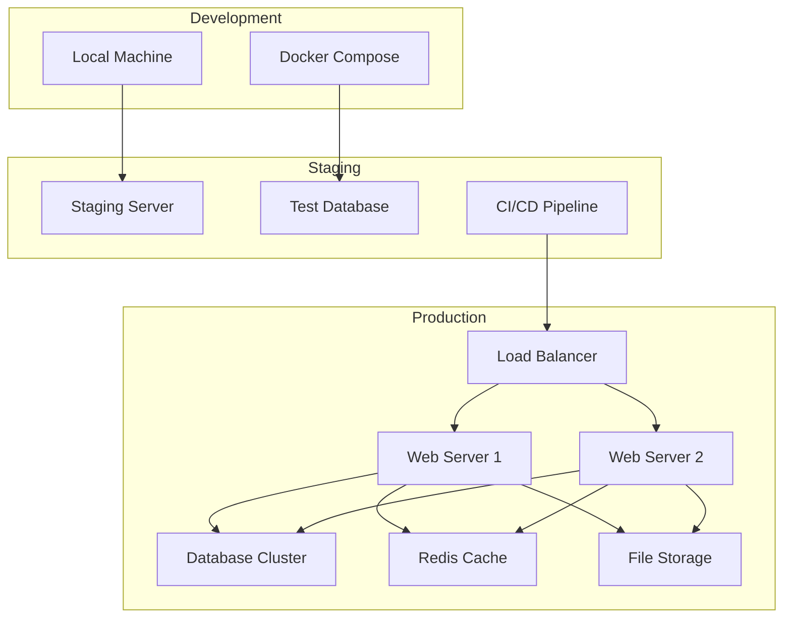
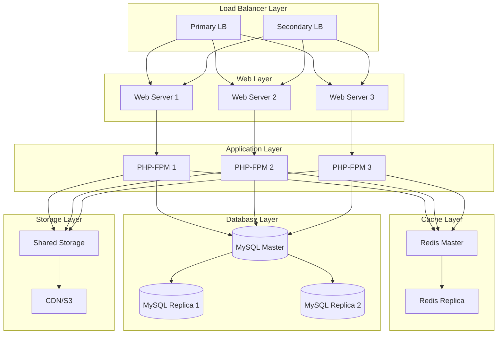
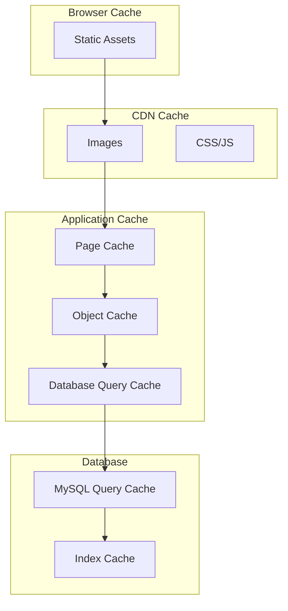

# Deployment Guide

## Table of Contents

1. [Deployment Overview](#deployment-overview)
2. [Environment Requirements](#environment-requirements)
3. [Local Development Deployment](#local-development-deployment)
4. [Staging Environment](#staging-environment)
5. [Production Deployment](#production-deployment)
6. [Docker Deployment](#docker-deployment)
7. [Cloud Deployments](#cloud-deployments)
8. [Security Hardening](#security-hardening)
9. [Performance Optimization](#performance-optimization)
10. [Monitoring and Maintenance](#monitoring-and-maintenance)

## Deployment Overview

O9Cart supports multiple deployment scenarios, from local development to high-availability production environments. This guide covers best practices for each deployment type.

### Deployment Architecture



## Environment Requirements

### System Requirements

#### Minimum Requirements
- **OS**: Linux (Ubuntu 20.04+ / CentOS 8+ / RHEL 8+)
- **PHP**: 8.0.2 or higher
- **Database**: MySQL 8.0+ or MariaDB 10.3+
- **Web Server**: Apache 2.4+ or Nginx 1.18+
- **Memory**: 1GB RAM (2GB+ recommended)
- **Storage**: 10GB SSD space

#### Production Requirements
- **OS**: Linux (Ubuntu 22.04 LTS recommended)
- **PHP**: 8.1+ with OPcache
- **Database**: MySQL 8.0+ (InnoDB engine)
- **Web Server**: Nginx 1.20+ with SSL
- **Memory**: 4GB+ RAM
- **Storage**: 50GB+ SSD with backup strategy

### Required PHP Extensions

```bash
# Install required PHP extensions (Ubuntu/Debian)
sudo apt-get install -y \
    php8.1-cli php8.1-fpm php8.1-mysql php8.1-curl php8.1-gd \
    php8.1-mbstring php8.1-xml php8.1-zip php8.1-intl php8.1-bcmath \
    php8.1-opcache php8.1-redis
```

## Local Development Deployment

### Quick Start with Docker

```bash
# Clone repository
git clone https://github.com/EchoCog/o9cart.git
cd o9cart

# Start development environment
make init
make build
make up

# Access the application
# Frontend: http://localhost
# Admin: http://localhost/admin
```

### Manual Local Setup

#### 1. Install Dependencies

```bash
# Install Composer dependencies
composer install --no-dev --optimize-autoloader

# Set up configuration files
cp upload/config-dist.php upload/config.php
cp upload/admin/config-dist.php upload/admin/config.php
```

#### 2. Database Setup

```sql
-- Create database
CREATE DATABASE o9cart CHARACTER SET utf8mb4 COLLATE utf8mb4_unicode_ci;

-- Create user
CREATE USER 'o9cart'@'localhost' IDENTIFIED BY 'secure_password';
GRANT ALL PRIVILEGES ON o9cart.* TO 'o9cart'@'localhost';
FLUSH PRIVILEGES;
```

#### 3. Web Server Configuration

**Apache Configuration** (`/etc/apache2/sites-available/o9cart.conf`):

```apache
<VirtualHost *:80>
    ServerName o9cart.local
    DocumentRoot /var/www/o9cart/upload
    
    <Directory /var/www/o9cart/upload>
        AllowOverride All
        Require all granted
        
        # Security headers
        Header always set X-Frame-Options SAMEORIGIN
        Header always set X-Content-Type-Options nosniff
        Header always set X-XSS-Protection "1; mode=block"
    </Directory>
    
    # Log files
    ErrorLog ${APACHE_LOG_DIR}/o9cart_error.log
    CustomLog ${APACHE_LOG_DIR}/o9cart_access.log combined
</VirtualHost>
```

**Nginx Configuration** (`/etc/nginx/sites-available/o9cart`):

```nginx
server {
    listen 80;
    server_name o9cart.local;
    root /var/www/o9cart/upload;
    index index.php index.html index.htm;

    # Security headers
    add_header X-Frame-Options SAMEORIGIN;
    add_header X-Content-Type-Options nosniff;
    add_header X-XSS-Protection "1; mode=block";

    # Main location
    location / {
        try_files $uri $uri/ /index.php?$args;
    }

    # Admin location
    location /admin {
        try_files $uri $uri/ /admin/index.php?$args;
    }

    # PHP processing
    location ~ \.php$ {
        include snippets/fastcgi-php.conf;
        fastcgi_pass unix:/var/run/php/php8.1-fpm.sock;
        fastcgi_param SCRIPT_FILENAME $document_root$fastcgi_script_name;
        include fastcgi_params;
    }

    # Deny access to sensitive files
    location ~ /\. {
        deny all;
    }
    
    location ~ /(config|cache|logs|image/cache) {
        deny all;
    }
}
```

#### 4. Set File Permissions

```bash
# Set ownership
sudo chown -R www-data:www-data /var/www/o9cart

# Set directory permissions
sudo find /var/www/o9cart -type d -exec chmod 755 {} \;

# Set file permissions
sudo find /var/www/o9cart -type f -exec chmod 644 {} \;

# Make specific files writable
sudo chmod 666 /var/www/o9cart/upload/config.php
sudo chmod 666 /var/www/o9cart/upload/admin/config.php
sudo chmod -R 777 /var/www/o9cart/upload/system/storage/
sudo chmod -R 777 /var/www/o9cart/upload/image/
```

## Staging Environment

### CI/CD Pipeline Setup

#### GitHub Actions Workflow (`.github/workflows/deploy-staging.yml`):

```yaml
name: Deploy to Staging

on:
  push:
    branches: [develop]
  pull_request:
    branches: [main]

jobs:
  test:
    runs-on: ubuntu-latest
    
    services:
      mysql:
        image: mysql:8.0
        env:
          MYSQL_ROOT_PASSWORD: root
          MYSQL_DATABASE: o9cart_test
        options: >-
          --health-cmd="mysqladmin ping"
          --health-interval=10s
          --health-timeout=5s
          --health-retries=3
    
    steps:
    - uses: actions/checkout@v3
    
    - name: Setup PHP
      uses: shivammathur/setup-php@v2
      with:
        php-version: '8.1'
        extensions: mbstring, xml, ctype, iconv, intl, mysql
        coverage: xdebug
    
    - name: Install dependencies
      run: composer install --prefer-dist --no-progress
    
    - name: Run tests
      run: ./vendor/bin/phpunit
    
    - name: Run code analysis
      run: ./tools/phpstan.phar analyse
  
  deploy-staging:
    needs: test
    runs-on: ubuntu-latest
    if: github.ref == 'refs/heads/develop'
    
    steps:
    - uses: actions/checkout@v3
    
    - name: Deploy to staging
      uses: appleboy/ssh-action@v0.1.5
      with:
        host: ${{ secrets.STAGING_HOST }}
        username: ${{ secrets.STAGING_USER }}
        key: ${{ secrets.STAGING_SSH_KEY }}
        script: |
          cd /var/www/o9cart-staging
          git pull origin develop
          composer install --no-dev --optimize-autoloader
          php artisan cache:clear
          php artisan config:cache
```

#### Staging Server Setup

```bash
# Install required packages
sudo apt update
sudo apt install -y nginx php8.1-fpm mysql-server redis-server

# Configure staging environment
sudo cp /etc/nginx/sites-available/default /etc/nginx/sites-available/o9cart-staging
sudo ln -s /etc/nginx/sites-available/o9cart-staging /etc/nginx/sites-enabled/

# Reload services
sudo systemctl reload nginx
sudo systemctl restart php8.1-fpm
```

## Production Deployment

### High-Availability Architecture



### Load Balancer Configuration

#### Nginx Load Balancer (`/etc/nginx/nginx.conf`):

```nginx
upstream o9cart_backend {
    least_conn;
    server 10.0.1.10:80 max_fails=3 fail_timeout=30s;
    server 10.0.1.11:80 max_fails=3 fail_timeout=30s;
    server 10.0.1.12:80 max_fails=3 fail_timeout=30s;
}

server {
    listen 80;
    listen 443 ssl http2;
    server_name o9cart.com www.o9cart.com;
    
    # SSL configuration
    ssl_certificate /etc/ssl/certs/o9cart.com.crt;
    ssl_certificate_key /etc/ssl/private/o9cart.com.key;
    ssl_protocols TLSv1.2 TLSv1.3;
    ssl_ciphers ECDHE-RSA-AES256-GCM-SHA512:DHE-RSA-AES256-GCM-SHA512;
    ssl_prefer_server_ciphers off;
    ssl_dhparam /etc/ssl/certs/dhparam.pem;
    
    # Security headers
    add_header Strict-Transport-Security "max-age=31536000" always;
    add_header X-Frame-Options SAMEORIGIN;
    add_header X-Content-Type-Options nosniff;
    add_header X-XSS-Protection "1; mode=block";
    
    # Redirect HTTP to HTTPS
    if ($scheme != "https") {
        return 301 https://$server_name$request_uri;
    }
    
    location / {
        proxy_pass http://o9cart_backend;
        proxy_set_header Host $host;
        proxy_set_header X-Real-IP $remote_addr;
        proxy_set_header X-Forwarded-For $proxy_add_x_forwarded_for;
        proxy_set_header X-Forwarded-Proto $scheme;
        
        # Health check
        proxy_connect_timeout 5s;
        proxy_send_timeout 60s;
        proxy_read_timeout 60s;
    }
    
    # Static files cache
    location ~* \.(jpg|jpeg|png|gif|ico|css|js|woff|woff2|ttf)$ {
        proxy_pass http://o9cart_backend;
        proxy_cache_valid 200 1h;
        add_header Cache-Control "public, max-age=3600";
    }
}
```

### Database Configuration

#### MySQL Master Configuration (`/etc/mysql/mysql.conf.d/mysqld.cnf`):

```ini
[mysqld]
# Basic settings
bind-address = 0.0.0.0
port = 3306

# Performance tuning
innodb_buffer_pool_size = 2G
innodb_log_file_size = 256M
innodb_flush_log_at_trx_commit = 1
innodb_flush_method = O_DIRECT
max_connections = 1000
thread_cache_size = 50
query_cache_type = 1
query_cache_size = 256M

# Binary logging for replication
server-id = 1
log-bin = mysql-bin
binlog-format = ROW
expire_logs_days = 7

# Slow query logging
slow_query_log = 1
slow_query_log_file = /var/log/mysql/slow.log
long_query_time = 2
```

#### MySQL Replica Configuration:

```ini
[mysqld]
server-id = 2
relay-log = mysql-relay-bin
read-only = 1

# Replication settings
slave-skip-errors = 1062
```

### Redis Configuration

#### Redis Master (`/etc/redis/redis.conf`):

```conf
# Network
bind 0.0.0.0
port 6379
protected-mode yes
requirepass your-secure-redis-password

# Memory
maxmemory 1gb
maxmemory-policy allkeys-lru

# Persistence
save 900 1
save 300 10
save 60 10000

# Replication
# (No additional config for master)

# Security
rename-command FLUSHDB ""
rename-command FLUSHALL ""
rename-command KEYS ""
```

### Application Configuration

#### Production PHP Configuration (`/etc/php/8.1/fpm/php.ini`):

```ini
; Production settings
memory_limit = 512M
max_execution_time = 300
max_input_time = 300
post_max_size = 100M
upload_max_filesize = 100M
max_file_uploads = 20

; OPcache settings
opcache.enable = 1
opcache.enable_cli = 1
opcache.memory_consumption = 256
opcache.interned_strings_buffer = 16
opcache.max_accelerated_files = 10000
opcache.revalidate_freq = 0
opcache.validate_timestamps = 0
opcache.fast_shutdown = 1

; Session settings
session.save_handler = redis
session.save_path = "tcp://127.0.0.1:6379?auth=your-redis-password"

; Error handling
display_errors = Off
log_errors = On
error_log = /var/log/php/error.log
```

## Docker Deployment

### Production Docker Compose

```yaml
version: '3.8'

services:
  nginx:
    image: nginx:alpine
    ports:
      - "80:80"
      - "443:443"
    volumes:
      - ./docker/nginx/nginx.conf:/etc/nginx/nginx.conf
      - ./docker/ssl:/etc/ssl/certs
      - app-data:/var/www/html
    depends_on:
      - app
    restart: unless-stopped

  app:
    build:
      context: .
      dockerfile: docker/Dockerfile
    volumes:
      - app-data:/var/www/html
      - ./upload/system/storage:/var/www/html/system/storage
    environment:
      - PHP_MEMORY_LIMIT=512M
      - PHP_OPCACHE_ENABLE=1
    depends_on:
      - mysql
      - redis
    restart: unless-stopped

  mysql:
    image: mysql:8.0
    environment:
      MYSQL_ROOT_PASSWORD: ${DB_ROOT_PASSWORD}
      MYSQL_DATABASE: ${DB_DATABASE}
      MYSQL_USER: ${DB_USERNAME}
      MYSQL_PASSWORD: ${DB_PASSWORD}
    volumes:
      - mysql-data:/var/lib/mysql
      - ./docker/mysql/my.cnf:/etc/mysql/conf.d/custom.cnf
    ports:
      - "3306:3306"
    restart: unless-stopped

  redis:
    image: redis:7-alpine
    command: redis-server --requirepass ${REDIS_PASSWORD}
    volumes:
      - redis-data:/data
    ports:
      - "6379:6379"
    restart: unless-stopped

volumes:
  app-data:
  mysql-data:
  redis-data:
```

### Docker Production Build

```dockerfile
# docker/Dockerfile
FROM php:8.1-fpm-alpine

# Install system dependencies
RUN apk add --no-cache \
    nginx \
    mysql-client \
    freetype-dev \
    libjpeg-turbo-dev \
    libpng-dev \
    libzip-dev \
    icu-dev \
    oniguruma-dev

# Install PHP extensions
RUN docker-php-ext-configure gd --with-freetype --with-jpeg \
    && docker-php-ext-install -j$(nproc) \
        gd \
        mysqli \
        pdo_mysql \
        zip \
        intl \
        mbstring \
        opcache

# Install Redis extension
RUN pecl install redis && docker-php-ext-enable redis

# Configure PHP
COPY docker/php/php-prod.ini /usr/local/etc/php/php.ini
COPY docker/php/opcache.ini /usr/local/etc/php/conf.d/opcache.ini

# Copy application
COPY --chown=www-data:www-data upload/ /var/www/html/

# Set permissions
RUN chmod -R 755 /var/www/html \
    && chmod -R 777 /var/www/html/system/storage \
    && chmod -R 777 /var/www/html/image

EXPOSE 9000
CMD ["php-fpm"]
```

## Cloud Deployments

### AWS Deployment

#### Using AWS ECS with Fargate

```yaml
# docker-compose.aws.yml
version: '3.8'

services:
  app:
    image: your-account.dkr.ecr.region.amazonaws.com/o9cart:latest
    environment:
      - DB_HOST=${RDS_ENDPOINT}
      - DB_DATABASE=${RDS_DATABASE}
      - DB_USERNAME=${RDS_USERNAME}
      - DB_PASSWORD=${RDS_PASSWORD}
      - REDIS_HOST=${ELASTICACHE_ENDPOINT}
      - S3_BUCKET=${S3_BUCKET}
      - CDN_URL=${CLOUDFRONT_URL}
    logging:
      driver: awslogs
      options:
        awslogs-group: /ecs/o9cart
        awslogs-region: us-east-1
        awslogs-stream-prefix: ecs
```

#### Terraform Infrastructure

```hcl
# infrastructure/main.tf
resource "aws_ecs_cluster" "o9cart" {
  name = "o9cart-cluster"
  
  capacity_providers = ["FARGATE"]
  default_capacity_provider_strategy {
    capacity_provider = "FARGATE"
  }
}

resource "aws_rds_instance" "o9cart" {
  identifier           = "o9cart-db"
  engine              = "mysql"
  engine_version      = "8.0"
  instance_class      = "db.t3.medium"
  allocated_storage   = 100
  storage_encrypted   = true
  
  db_name  = "o9cart"
  username = "admin"
  password = var.db_password
  
  vpc_security_group_ids = [aws_security_group.rds.id]
  db_subnet_group_name   = aws_db_subnet_group.default.name
  
  backup_retention_period = 7
  backup_window          = "03:00-04:00"
  maintenance_window     = "sun:04:00-sun:05:00"
  
  skip_final_snapshot = false
  final_snapshot_identifier = "o9cart-final-snapshot"
}

resource "aws_elasticache_cluster" "o9cart" {
  cluster_id           = "o9cart-cache"
  engine              = "redis"
  node_type           = "cache.t3.micro"
  num_cache_nodes     = 1
  parameter_group_name = "default.redis7"
  port                = 6379
  subnet_group_name   = aws_elasticache_subnet_group.default.name
  security_group_ids  = [aws_security_group.elasticache.id]
}
```

### Google Cloud Platform

```yaml
# gcp/app.yaml
runtime: php81

env_variables:
  DB_CONNECTION: mysql
  DB_HOST: /cloudsql/project-id:region:instance-name
  DB_DATABASE: o9cart
  DB_USERNAME: root
  DB_PASSWORD: your-password
  
  CACHE_DRIVER: redis
  REDIS_HOST: 10.0.0.3
  REDIS_PORT: 6379

automatic_scaling:
  min_instances: 2
  max_instances: 10
  target_cpu_utilization: 0.6

resources:
  cpu: 1
  memory_gb: 1
```

## Security Hardening

### Server Security

```bash
# Firewall configuration
sudo ufw enable
sudo ufw default deny incoming
sudo ufw default allow outgoing
sudo ufw allow ssh
sudo ufw allow 80/tcp
sudo ufw allow 443/tcp

# Fail2ban for SSH protection
sudo apt install fail2ban
sudo cp /etc/fail2ban/jail.conf /etc/fail2ban/jail.local

# Automatic security updates
sudo apt install unattended-upgrades
sudo dpkg-reconfigure -plow unattended-upgrades
```

### Application Security

#### Security Headers

```nginx
# Security headers
add_header X-Frame-Options "SAMEORIGIN" always;
add_header X-Content-Type-Options "nosniff" always;
add_header X-XSS-Protection "1; mode=block" always;
add_header Referrer-Policy "no-referrer-when-downgrade" always;
add_header Content-Security-Policy "default-src 'self' http: https: data: blob: 'unsafe-inline'" always;
add_header Strict-Transport-Security "max-age=31536000; includeSubDomains" always;
```

#### File System Security

```bash
# Secure file permissions
find /var/www/o9cart -type f -exec chmod 644 {} \;
find /var/www/o9cart -type d -exec chmod 755 {} \;

# Protect sensitive files
chmod 600 /var/www/o9cart/upload/config.php
chmod 600 /var/www/o9cart/upload/admin/config.php

# Remove unnecessary files
rm -rf /var/www/o9cart/upload/install/
```

## Performance Optimization

### Caching Strategy



### Performance Monitoring

```bash
# Install monitoring tools
sudo apt install htop iotop nethogs

# PHP-FPM monitoring
sudo systemctl status php8.1-fpm
sudo cat /var/log/php8.1-fpm.log

# MySQL monitoring
mysqladmin -u root -p processlist
mysqladmin -u root -p status

# Disk monitoring
df -h
iostat -x 1

# Network monitoring
netstat -tlnp
ss -tlnp
```

## Monitoring and Maintenance

### Log Management

```bash
# Configure log rotation
sudo nano /etc/logrotate.d/o9cart

/var/www/o9cart/upload/system/storage/logs/*.log {
    daily
    missingok
    rotate 30
    compress
    delaycompress
    notifempty
    copytruncate
    su www-data www-data
}
```

### Backup Strategy

```bash
#!/bin/bash
# backup.sh - Daily backup script

BACKUP_DIR="/backups/o9cart"
DATE=$(date +%Y%m%d_%H%M%S)

# Database backup
mysqldump -u backup_user -p'backup_password' \
  --single-transaction --routines --triggers \
  o9cart > "$BACKUP_DIR/db_backup_$DATE.sql"

# File backup
tar -czf "$BACKUP_DIR/files_backup_$DATE.tar.gz" \
  -C /var/www/o9cart/upload \
  --exclude='system/storage/cache' \
  --exclude='system/storage/logs' \
  .

# Clean old backups (keep 30 days)
find "$BACKUP_DIR" -name "*.sql" -mtime +30 -delete
find "$BACKUP_DIR" -name "*.tar.gz" -mtime +30 -delete

# Upload to S3 (optional)
aws s3 sync "$BACKUP_DIR" s3://your-backup-bucket/o9cart/
```

### Health Checks

```bash
#!/bin/bash
# health_check.sh

# Check web server
curl -f http://localhost/health || exit 1

# Check database
mysql -u health_user -p'health_password' -e "SELECT 1" > /dev/null || exit 1

# Check Redis
redis-cli ping | grep PONG > /dev/null || exit 1

# Check disk space
DISK_USAGE=$(df / | tail -1 | awk '{print $5}' | sed 's/%//')
if [ "$DISK_USAGE" -gt 90 ]; then
    echo "Disk usage is above 90%"
    exit 1
fi

echo "All health checks passed"
```

This deployment guide provides comprehensive instructions for deploying O9Cart in various environments, from development to production. Choose the deployment strategy that best fits your requirements and infrastructure.