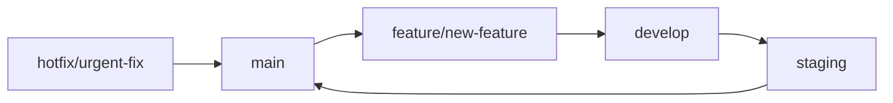

# Developer Guide

## Table of Contents

1. [Development Environment Setup](#development-environment-setup)
2. [Project Structure](#project-structure)
3. [Coding Standards](#coding-standards)
4. [Development Workflow](#development-workflow)
5. [Testing](#testing)
6. [Debugging](#debugging)
7. [Extension Development](#extension-development)
8. [API Development](#api-development)

## Development Environment Setup

### Local Development with Docker

The fastest way to get started is using our Docker environment:

```bash
# Clone the repository
git clone https://github.com/EchoCog/o9cart.git
cd o9cart

# Initialize the environment
make init

# Build Docker images
make build

# Start the environment
make up
```

Your development environment will be available at:
- **Store Frontend**: http://localhost
- **Admin Panel**: http://localhost/admin
- **API Endpoint**: http://localhost/api

### Manual Setup

If you prefer a manual setup:

#### Requirements
- PHP 8.0+ with extensions: `curl`, `gd`, `zip`, `mysqli`, `mbstring`, `json`, `openssl`, `xml`
- MySQL 8.0+ or MariaDB 10.3+
- Apache or Nginx web server
- Composer for dependency management

#### Installation Steps

1. **Set up web server**:
   ```bash
   # For Apache, ensure mod_rewrite is enabled
   sudo a2enmod rewrite
   sudo systemctl restart apache2
   ```

2. **Configure database**:
   ```sql
   CREATE DATABASE o9cart;
   CREATE USER 'o9cart'@'localhost' IDENTIFIED BY 'secure_password';
   GRANT ALL PRIVILEGES ON o9cart.* TO 'o9cart'@'localhost';
   FLUSH PRIVILEGES;
   ```

3. **Install dependencies**:
   ```bash
   composer install
   ```

4. **Configure application**:
   ```bash
   cp upload/config-dist.php upload/config.php
   cp upload/admin/config-dist.php upload/admin/config.php
   ```

5. **Set permissions**:
   ```bash
   chmod 0777 upload/config.php
   chmod 0777 upload/admin/config.php
   chmod -R 0777 upload/system/storage/
   chmod -R 0777 upload/image/
   ```

## Project Structure

```
o9cart/
├── docs/                          # Documentation
│   ├── architecture.md
│   ├── developer-guide.md
│   └── api/
├── tools/                         # Development tools
│   ├── daux.io/                   # Documentation generator
│   ├── php-cs-fixer.phar         # Code formatter
│   └── phpstan.phar              # Static analysis
├── upload/                        # Main application
│   ├── admin/                     # Admin panel
│   │   ├── controller/
│   │   ├── model/
│   │   ├── view/
│   │   └── language/
│   ├── catalog/                   # Customer frontend
│   │   ├── controller/
│   │   ├── model/
│   │   ├── view/
│   │   └── language/
│   ├── system/                    # Core system
│   │   ├── engine/               # Core engine
│   │   ├── library/              # System libraries
│   │   ├── helper/               # Helper functions
│   │   └── storage/              # File storage
│   ├── extension/                # Extensions
│   └── image/                    # Image storage
├── docker/                       # Docker configuration
├── .github/                      # GitHub workflows
├── composer.json                 # PHP dependencies
├── Makefile                      # Development commands
└── README.md
```

### Core Directories Explained

#### `/upload/system/engine/`
Contains the core framework classes:
- `action.php` - Base controller class
- `controller.php` - Controller base class
- `event.php` - Event system
- `loader.php` - Class loader
- `model.php` - Base model class
- `registry.php` - Dependency injection container

#### `/upload/system/library/`
System libraries for common functionality:
- `cart/` - Shopping cart functionality
- `currency.php` - Currency handling
- `customer.php` - Customer management
- `db/` - Database abstraction
- `mail/` - Email functionality
- `session/` - Session management
- `tax.php` - Tax calculations
- `url.php` - URL generation

#### `/upload/system/helper/`
Helper functions for common tasks:
- `general.php` - General utility functions
- `json.php` - JSON handling
- `utf8.php` - UTF-8 string functions

## Coding Standards

O9Cart follows PSR-12 coding standards with some project-specific conventions.

### PHP Coding Standards

```php
<?php
namespace Opencart\Catalog\Controller\Common;

/**
 * Class Header
 *
 * @package Opencart\Catalog\Controller\Common
 */
class Header extends \Opencart\System\Engine\Controller
{
    /**
     * Main index method
     *
     * @return string
     */
    public function index(): string
    {
        // Load language file
        $this->load->language('common/header');
        
        // Set page data
        $data['title'] = $this->document->getTitle();
        $data['description'] = $this->document->getDescription();
        
        // Return rendered template
        return $this->load->view('common/header', $data);
    }
    
    /**
     * Private helper method
     *
     * @param array $options
     * @return bool
     */
    private function validateOptions(array $options): bool
    {
        return !empty($options['required_field']);
    }
}
```

### JavaScript Standards

```javascript
/**
 * O9Cart JavaScript Module
 */
(function($) {
    'use strict';
    
    var O9Cart = {
        /**
         * Initialize the module
         */
        init: function() {
            this.bindEvents();
            this.loadComponents();
        },
        
        /**
         * Bind event handlers
         */
        bindEvents: function() {
            $(document).on('click', '.btn-cart', this.addToCart);
        },
        
        /**
         * Add item to cart
         */
        addToCart: function(e) {
            e.preventDefault();
            
            var productId = $(this).data('product-id');
            var quantity = $('#quantity').val() || 1;
            
            $.ajax({
                url: 'index.php?route=checkout/cart/add',
                type: 'POST',
                data: {
                    product_id: productId,
                    quantity: quantity
                },
                dataType: 'json',
                success: function(response) {
                    if (response.success) {
                        $('#cart-total').text(response.total);
                        showAlert('Product added to cart!', 'success');
                    }
                }
            });
        }
    };
    
    // Initialize when document ready
    $(document).ready(function() {
        O9Cart.init();
    });
    
})(jQuery);
```

### Database Naming Conventions

```sql
-- Table names: lowercase with underscores
CREATE TABLE oc_product (
    product_id int(11) NOT NULL AUTO_INCREMENT,
    model varchar(64) NOT NULL,
    sku varchar(64) DEFAULT NULL,
    upc varchar(12) DEFAULT NULL,
    ean varchar(14) DEFAULT NULL,
    jan varchar(13) DEFAULT NULL,
    isbn varchar(17) DEFAULT NULL,
    mpn varchar(64) DEFAULT NULL,
    location varchar(128) DEFAULT NULL,
    quantity int(4) NOT NULL DEFAULT '0',
    stock_status_id int(11) NOT NULL,
    image varchar(255) DEFAULT NULL,
    manufacturer_id int(11) NOT NULL,
    shipping tinyint(1) NOT NULL DEFAULT '1',
    price decimal(15,4) NOT NULL DEFAULT '0.0000',
    points int(8) NOT NULL DEFAULT '0',
    tax_class_id int(11) NOT NULL,
    date_available date NOT NULL DEFAULT '0000-00-00',
    weight decimal(15,8) NOT NULL DEFAULT '0.00000000',
    weight_class_id int(11) NOT NULL DEFAULT '0',
    length decimal(15,8) NOT NULL DEFAULT '0.00000000',
    width decimal(15,8) NOT NULL DEFAULT '0.00000000',
    height decimal(15,8) NOT NULL DEFAULT '0.00000000',
    length_class_id int(11) NOT NULL DEFAULT '0',
    subtract tinyint(1) NOT NULL DEFAULT '1',
    minimum int(11) NOT NULL DEFAULT '1',
    sort_order int(11) NOT NULL DEFAULT '0',
    status tinyint(1) NOT NULL DEFAULT '0',
    viewed int(5) NOT NULL DEFAULT '0',
    date_added datetime NOT NULL,
    date_modified datetime NOT NULL,
    PRIMARY KEY (product_id)
);
```

## Development Workflow

### Git Workflow

We use a feature branch workflow:



1. **Create feature branch**:
   ```bash
   git checkout -b feature/your-feature-name
   ```

2. **Make changes and commit**:
   ```bash
   git add .
   git commit -m "feat: add new feature description"
   ```

3. **Push and create PR**:
   ```bash
   git push origin feature/your-feature-name
   ```

### Commit Message Convention

We follow conventional commits:

- `feat:` New features
- `fix:` Bug fixes
- `docs:` Documentation changes
- `style:` Code formatting changes
- `refactor:` Code refactoring
- `test:` Test additions or modifications
- `chore:` Build process or auxiliary tool changes

## Testing

### Running Tests

```bash
# Run all tests
make test

# Run specific test suite
./vendor/bin/phpunit tests/unit/
./vendor/bin/phpunit tests/integration/

# Run with coverage
./vendor/bin/phpunit --coverage-html coverage/
```

### Writing Unit Tests

```php
<?php
namespace Tests\Unit\System\Library;

use PHPUnit\Framework\TestCase;
use Opencart\System\Library\Cart\Cart;

class CartTest extends TestCase
{
    private $cart;
    
    public function setUp(): void
    {
        $this->cart = new Cart();
    }
    
    public function testAddProduct(): void
    {
        $productId = 1;
        $quantity = 2;
        
        $this->cart->add($productId, $quantity);
        
        $this->assertEquals($quantity, $this->cart->getQuantity($productId));
        $this->assertTrue($this->cart->hasProducts());
    }
    
    public function testRemoveProduct(): void
    {
        $productId = 1;
        $this->cart->add($productId, 1);
        
        $this->cart->remove($productId);
        
        $this->assertFalse($this->cart->hasProducts());
    }
}
```

## Debugging

### Development Tools

#### Enable Debug Mode
```php
// In config.php
define('DEBUG', true);
define('ERROR_REPORTING', E_ALL);
define('ERROR_DISPLAY', true);
define('ERROR_LOG', true);
```

#### Using Xdebug
```ini
; In php.ini
zend_extension=xdebug
xdebug.mode=develop,debug
xdebug.start_with_request=yes
xdebug.client_host=localhost
xdebug.client_port=9003
```

#### Database Query Debugging
```php
// Add to controller to see executed queries
$queries = $this->db->getQueries();
foreach ($queries as $query) {
    error_log($query);
}
```

### Logging

```php
// System logging
$this->log->write('Debug message: ' . print_r($data, true));

// Custom logging
$log = new \Opencart\System\Library\Log('custom.log');
$log->write('Custom log entry');
```

### Common Debugging Techniques

1. **Error Logs**: Check `system/storage/logs/error.log`
2. **Database Logs**: Enable MySQL query logging
3. **Browser DevTools**: Use Network tab for AJAX debugging
4. **Postman**: Test API endpoints

## Extension Development

### Creating a Custom Module

```php
<?php
// admin/controller/extension/module/my_module.php
namespace Opencart\Admin\Controller\Extension\Module;

class MyModule extends \Opencart\System\Engine\Controller
{
    public function index(): void
    {
        $this->load->language('extension/module/my_module');
        
        $this->document->setTitle($this->language->get('heading_title'));
        
        // Handle form submission
        if (($this->request->server['REQUEST_METHOD'] == 'POST') && $this->validate()) {
            $this->model_setting_setting->editSetting('module_my_module', $this->request->post);
            
            $this->session->data['success'] = $this->language->get('text_success');
            
            $this->response->redirect($this->url->link('marketplace/extension', 'user_token=' . $this->session->data['user_token'] . '&type=module'));
        }
        
        // Set template data
        $data['breadcrumbs'] = array();
        
        $data['breadcrumbs'][] = array(
            'text' => $this->language->get('text_home'),
            'href' => $this->url->link('common/dashboard', 'user_token=' . $this->session->data['user_token'])
        );
        
        $data['header'] = $this->load->controller('common/header');
        $data['column_left'] = $this->load->controller('common/column_left');
        $data['footer'] = $this->load->controller('common/footer');
        
        $this->response->setOutput($this->load->view('extension/module/my_module', $data));
    }
    
    private function validate(): bool
    {
        if (!$this->user->hasPermission('modify', 'extension/module/my_module')) {
            $this->error['warning'] = $this->language->get('error_permission');
        }
        
        return !$this->error;
    }
}
```

### Extension Structure

```
extension/
├── my_module/
│   ├── admin/
│   │   ├── controller/extension/module/my_module.php
│   │   ├── language/en-gb/extension/module/my_module.php
│   │   └── view/template/extension/module/my_module.twig
│   ├── catalog/
│   │   ├── controller/extension/module/my_module.php
│   │   └── view/template/extension/module/my_module.twig
│   └── install.sql
```

## API Development

### Creating API Endpoints

```php
<?php
// catalog/controller/api/product.php
namespace Opencart\Catalog\Controller\Api;

class Product extends \Opencart\System\Engine\Controller
{
    public function index(): void
    {
        $this->load->language('api/product');
        
        // API authentication check
        if (!isset($this->session->data['api_id'])) {
            $json['error']['warning'] = $this->language->get('error_permission');
        } else {
            $this->load->model('catalog/product');
            
            if (isset($this->request->get['product_id'])) {
                $product_id = (int)$this->request->get['product_id'];
                
                $product = $this->model_catalog_product->getProduct($product_id);
                
                if ($product) {
                    $json['success'] = true;
                    $json['data'] = $product;
                } else {
                    $json['error'] = 'Product not found';
                }
            } else {
                $json['error'] = 'Product ID required';
            }
        }
        
        $this->response->addHeader('Content-Type: application/json');
        $this->response->setOutput(json_encode($json));
    }
}
```

### API Testing

```bash
# Test API endpoint
curl -X GET "http://localhost/api/product&product_id=1" \
  -H "Content-Type: application/json" \
  -H "Authorization: Bearer YOUR_API_TOKEN"
```

## Performance Optimization

### Caching

```php
// Implement caching in controllers
public function index(): void
{
    $cache_key = 'product.list.' . md5(serialize($this->request->get));
    
    $data = $this->cache->get($cache_key);
    
    if (!$data) {
        // Generate data
        $data = $this->generateProductList();
        
        // Cache for 1 hour
        $this->cache->set($cache_key, $data, 3600);
    }
    
    $this->response->setOutput($this->load->view('product/list', $data));
}
```

### Database Optimization

```php
// Use prepared statements
$sql = "SELECT * FROM " . DB_PREFIX . "product WHERE status = ? AND date_available <= ?";
$query = $this->db->query($sql, array(1, date('Y-m-d')));

// Add database indexes
ALTER TABLE oc_product ADD INDEX idx_status_date (status, date_available);
```

## Development Commands

### Using Make Commands

```bash
# Development environment
make up            # Start development environment
make down          # Stop development environment
make logs          # View logs
make php           # Enter PHP container
make mysql         # Enter MySQL container

# Code quality
make lint          # Run PHP linter
make format        # Format code with PHP-CS-Fixer
make stan          # Run PHPStan analysis

# Testing
make test          # Run all tests
make test-unit     # Run unit tests only
make test-integration  # Run integration tests

# Documentation
make docs          # Generate documentation
make docs-serve    # Serve documentation locally
```

### Code Quality Tools

```bash
# PHP-CS-Fixer
./tools/php-cs-fixer.phar fix --config=.php-cs-fixer.php

# PHPStan
./tools/phpstan.phar analyse --configuration=phpstan.neon

# Generate API documentation
php tools/generate_api.php
```

This developer guide should help you get started with O9Cart development. For more specific topics, check the other documentation files in the `/docs` directory.