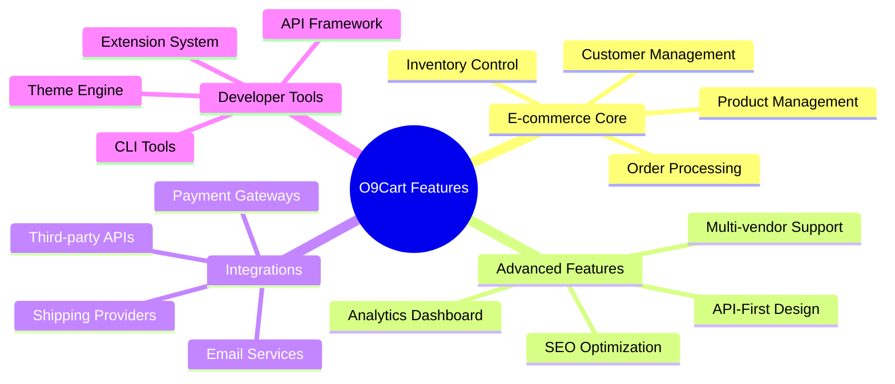
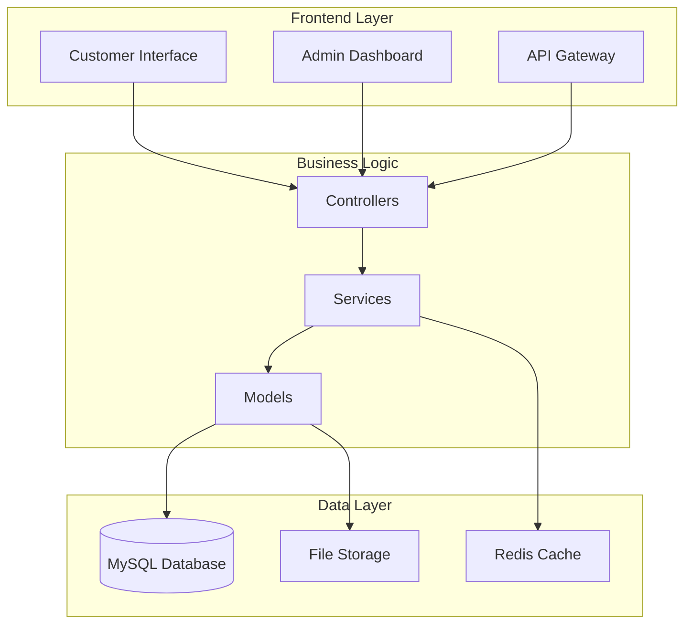

# O9Cart Documentation

Welcome to the comprehensive documentation for O9Cart - an advanced e-commerce platform built for modern businesses.

## 🚀 Quick Start

New to O9Cart? Start here to get up and running quickly:

- [Installation Guide](../INSTALL.md) - Set up O9Cart on your system
- [Docker Development](developer-guide.md#docker-development) - Quick setup with Docker
- [Configuration](deployment.md#application-configuration) - Configure your installation

## 📚 Documentation Sections

### 🏗️ Architecture & Design

- **[Technical Architecture](architecture.md)** - System design, components, and patterns
- **[Database Schema](database-schema.md)** - Complete database structure and relationships
- **[Security Architecture](architecture.md#security-architecture)** - Security layers and best practices

### 👨‍💻 Developer Resources

- **[Developer Guide](developer-guide.md)** - Development setup, coding standards, and workflow
- **[API Documentation](api-reference.md)** - Complete REST API reference
- **[Extension Development](developer-guide.md#extension-development)** - Create custom modules and themes

### 🚀 Deployment & Operations

- **[Deployment Guide](deployment.md)** - Production deployment strategies
- **[Performance Optimization](deployment.md#performance-optimization)** - Scaling and optimization
- **[Monitoring & Maintenance](deployment.md#monitoring-and-maintenance)** - Keep your system healthy

## 🎯 Feature Overview

O9Cart is packed with powerful features:



## 🔧 System Requirements

### Minimum Requirements
- **PHP**: 8.0.2 or higher
- **Database**: MySQL 8.0+ or MariaDB 10.3+
- **Web Server**: Apache 2.4+ or Nginx 1.18+
- **Memory**: 1GB RAM (2GB+ recommended)

### Recommended Environment
- **PHP**: 8.1+ with OPcache enabled
- **Database**: MySQL 8.0+ with InnoDB engine  
- **Web Server**: Nginx 1.20+ with SSL
- **Memory**: 4GB+ RAM
- **Storage**: SSD for better performance

## 🛠️ Development Workflow

Get started with development in minutes:

```bash
# 1. Clone the repository
git clone https://github.com/EchoCog/o9cart.git
cd o9cart

# 2. Start development environment
make init
make build
make up

# 3. Access your development site
# Frontend: http://localhost
# Admin: http://localhost/admin
```

## 📊 Architecture Overview

O9Cart follows modern architectural principles:



## 🔌 Extension System

O9Cart's powerful extension system allows you to:

- **Payment Modules**: Integrate with any payment gateway
- **Shipping Modules**: Support for various shipping providers  
- **Theme System**: Create custom designs and layouts
- **API Extensions**: Extend the REST API functionality
- **Custom Modules**: Add any business-specific features

## 🌐 API-First Architecture

Built with modern integrations in mind:

- **RESTful API**: Complete API coverage for all features
- **Authentication**: JWT-based secure authentication
- **Rate Limiting**: Built-in request throttling
- **Documentation**: Interactive API documentation
- **SDK Support**: Official SDKs for popular languages

## 📈 Performance Features

Optimized for high-traffic e-commerce:

- **Caching**: Multi-layer caching strategy
- **Database**: Optimized queries and indexing  
- **CDN**: Built-in CDN integration
- **Load Balancing**: Support for horizontal scaling
- **Monitoring**: Built-in performance monitoring

## 🛡️ Security Features

Enterprise-grade security:

- **Authentication**: Multi-factor authentication support
- **Authorization**: Role-based access control
- **Encryption**: Data encryption at rest and in transit
- **Compliance**: PCI DSS compliance ready
- **Monitoring**: Security event logging and monitoring

## 🤝 Contributing

We welcome contributions! Here's how to get started:

1. **Fork** the repository
2. **Create** a feature branch
3. **Make** your changes following our coding standards
4. **Test** your changes thoroughly
5. **Submit** a pull request

See our [Developer Guide](developer-guide.md) for detailed contribution guidelines.

## 📞 Support

Need help? We're here for you:

- **Documentation**: You're reading it! 📚
- **GitHub Issues**: [Report bugs or request features](https://github.com/EchoCog/o9cart/issues)
- **Community Forum**: Connect with other developers
- **Commercial Support**: Professional support available

## 📄 License

O9Cart is open-source software licensed under the [GPL v3](../LICENSE.md) license.

---

Ready to dive in? Start with our [Installation Guide](../INSTALL.md) or explore the [Architecture Documentation](architecture.md) to understand how everything works together.